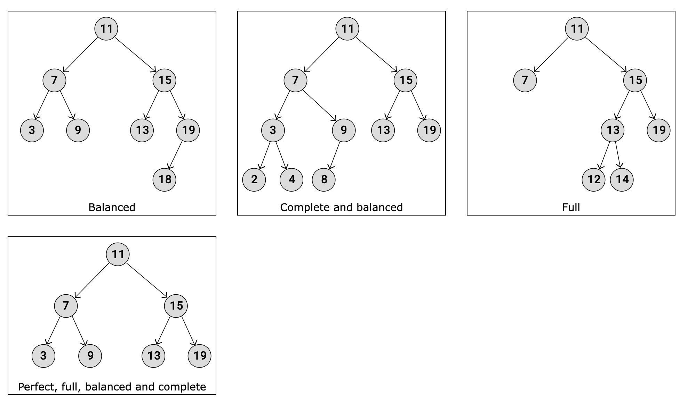
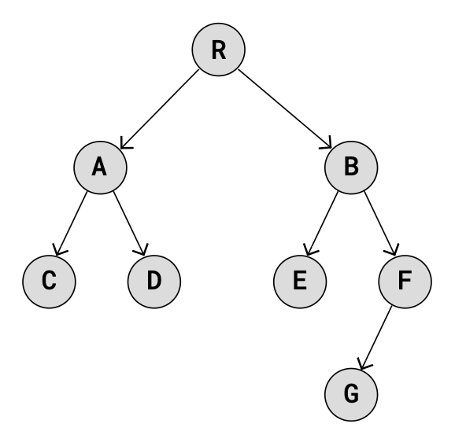

# Trees

In a Tree, a single element can have multiple 'next' elements, allowing the data structure to branch out in various directions.

The Tree data structure can be useful in many cases:

* Hierarchical Data: File systems, organizational models, etc.
* Databases: Used for quick data retrieval.
* Routing Tables: Used for routing data in network algorithms.
* Sorting/Searching: Used for sorting data and searching for data.
* Priority Queues: Priority queue data structures are commonly implemented using trees, such as binary heaps.

# Binary Trees

A Binary Tree is a type of tree data structure where each node can have a maximum of two child nodes, a left child node and a right child node.

This restriction, that a node can have a maximum of two child nodes, gives us many benefits:

* Algorithms like traversing, searching, insertion and deletion become easier to understand, to implement, and run faster.
* Keeping data sorted in a Binary Search Tree (BST) makes searching very efficient.
* Balancing trees is easier to do with a limited number of child nodes, using an AVL Binary Tree for example.
* Binary Trees can be represented as arrays, making the tree more memory efficient.

Binary Trees, such as Binary Search Trees and AVL Trees, are great compared to Arrays and Linked Lists because they are BOTH fast at accessing a node, AND fast when it comes to deleting or inserting a node, with no shifts in memory needed.

A **balanced** Binary Tree has at most 1 in difference between its left and right subtree heights, for each node in the tree.

A **complete** Binary Tree has all levels full of nodes, except the last level, which is can also be full, or filled from left to right. The properties of a complete Binary Tree means it is also balanced.

A **full** Binary Tree is a kind of tree where each node has either 0 or 2 child nodes.

A **perfect** Binary Tree has all leaf nodes on the same level, which means that all levels are full of nodes, and all internal nodes have two child nodes.The properties of a perfect Binary Tree means it is also full, balanced, and complete.

Binary Tree Traversal

- Breadth First Search (BFS)
- Depth First Search (DFS)
  - Pre-order
    1. visiting the root node first
    2. then recursively do a pre-order traversal of the left subtree
    3. followed by a recursive pre-order traversal of the right subtree
  - In-order: 
    1. does a recursive In-order Traversal of the left subtree
    2. visits the root node
    3. does a recursive In-order Traversal of the right subtree
  - Post-order
    1. recursively doing a Post-order Traversal of the left subtree
    2. recursively doing a Post-order Traversal of the right subtree
    3. visit to the root node. 

In-order: This traversal is mainly used for Binary Search Trees where it returns values in ascending order.

* Pre-order: Parent > Left > Right
  * R,A,C,D,B,E,F,G
* In-order: Left > Parent  > Right
  * C,A,D,R,E,B,G,F
* Post-order:  Left > Right > Parent
  * C,D,A,E,G,F,B,R

# Array Implementation of Binary Tree

Parent node: `arr[i]`
Left child node: `arr[2 * i + 1]`
Right child node: `arr[2 * i + 2]`
 
In the Array implementation, since the Binary Tree nodes are placed in an array, much of the code is about accessing nodes using indexes, and about how to find the correct indexes.

to avoid wasting space on empty Array elements, Binary Trees stored using Array implementation should be a "perfect" Binary Tree, or a nearly perfect one.

# Binary Search Trees
A Binary Search Tree (BST) is a type of Binary Tree data structure, where the following properties must be true for any node "X" in the tree:

The X node's left child and all of its descendants (children, children's children, and so on) have lower values than X's value.
The right child, and all its descendants have higher values than X's value.
Left and right subtrees must also be Binary Search Trees.

Fast to
- search
- add
- delete

search, add, delete: T_O(h), for balanced BST -> O(logn)
 

Check if a given tree is BST -> in-order tarversal

# AVL Trees
keeping a Binary Search Tree balanced is exactly what AVL Trees do

The only difference between a regular Binary Search Tree and an AVL Tree is that AVL Trees do rotation operations in addition, to keep the tree balance.

search, add, delete: T_O(logn)

## Balance factor

The Balance Factor BF(X) for a node (X) is the difference in height between its right and left subtrees

BF(X) = height(rightSubtree(X)) - height(leftSubtree(X))

Balance factor values
* 0: The node is in balance.
* more than 0: The node is "right heavy".
* less than 0: The node is "left heavy".

The Four "out-of-balance" Cases -> |BF(X)| > 1
- Left-Left (LL)
  - The unbalanced node and its left child node are both left-heavy.
  - A single right rotation.
- Right-Right (RR)
  - The unbalanced node and its right child node are both right-heavy.
  - A single left rotation.
- Left-Right (LR)
  - The unbalanced node is left heavy, and its left child node is right heavy.
  - First do a left rotation on the left child node, then do a right rotation on the unbalanced node.
- Right-Left (RL)
  - The unbalanced node is right heavy, and its right child node is left heavy.
  - First do a right rotation on the right child node, then do a left rotation on the unbalanced node.

