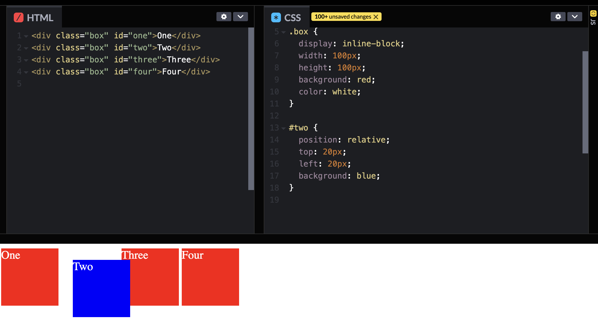

-   [JS](#js)
    -   [Event Loop](#event-loop)
        -   [Runtime concepts](#runtime-concepts)
            -   [Stack](#stack)
            -   [Heap](#heap)
            -   [Queue](#queue)
            -   [Event Loop](#event-loop-1)
            -   [Never blocking](#never-blocking)
    -   [Task Queue vs Microtask Queue:](#task-queue-vs-microtask-queue)
    -   [SPA](#spa)
    -   [Strict mode](#strict-mode)
    -   [Operators \> Conditional (ternary) operator](#operators--conditional-ternary-operator)
    -   [Security \> Same-Origin Policy (SOP)](#security--same-origin-policy-sop)
    -   [Load Event](#load-event)
    -   [Hoisting](#hoisting)
    -   [Template Literal](#template-literal)
        -   [Syntax](#syntax)
        -   [Multi-line strings](#multi-line-strings)
        -   [String interpolation](#string-interpolation)
        -   [Nesting templates](#nesting-templates)
        -   [Tagged templates](#tagged-templates)
    -   [CORS \& JSNOP](#cors--jsnop)
    -   [Fetching data](#fetching-data)
        -   [Fetch API](#fetch-api)
    -   [Ajax](#ajax)
    -   [Feture Detection](#feture-detection)
        -   [CSS feature detection](#css-feature-detection)
        -   [JS](#js-1)
    -   [User Agent](#user-agent)
        -   [Avoiding user agent detection](#avoiding-user-agent-detection)
        -   [Browser detection](#browser-detection)
    -   [Function](#function)
    -   [.forEach() vs .map()](#foreach-vs-map)
    -   [Closure](#closure)
        -   [Lexical Scoping](#lexical-scoping)
        -   [Scoping with let and const](#scoping-with-let-and-const)
        -   [How closure work?](#how-closure-work)
        -   [Practical closures](#practical-closures)
        -   [Emulating private methods with closures](#emulating-private-methods-with-closures)
        -   [Closure scope chain](#closure-scope-chain)
        -   [Performance considerations](#performance-considerations)
    -   [Promises](#promises)
        -   [Promise concurrency](#promise-concurrency)
        -   [Constructor](#constructor)
        -   [Promise\[Symbol.species\]](#promisesymbolspecies)
        -   [Promise.withResolvers()](#promisewithresolvers)
        -   [Other Static methods](#other-static-methods)
        -   [Instance properties](#instance-properties)
        -   [Using of Promise](#using-of-promise)
            -   [Promise rejection events](#promise-rejection-events)
            -   [Async to sync](#async-to-sync)
            -   [Good usage example](#good-usage-example)
            -   [Timing](#timing)
            -   [Task queues vs. microtasks](#task-queues-vs-microtasks)
        -   [Promise vs callback](#promise-vs-callback)
    -   [this](#this)
        -   [Function context](#function-context)
            -   [Arrow functions](#arrow-functions)
        -   [Constructor](#constructor-1)
    -   [Class context](#class-context)
        -   [Derived class constructors](#derived-class-constructors)
    -   [Global context](#global-context)
    -   [The bind() method](#the-bind-method)
    -   [`this` in arrow functions](#this-in-arrow-functions)
    -   [`this` with getter and setter](#this-with-getter-and-setter)
    -   [`this` in DOM event handlers](#this-in-dom-event-handlers)
    -   [`this` in inline event handlers](#this-in-inline-event-handlers)
    -   [Bound methods in classes](#bound-methods-in-classes)
    -   [Events](#events)
        -   [Notes](#notes)
        -   [Event delegation](#event-delegation)
        -   [Event Bubbling](#event-bubbling)
    -   [Object Prototypse](#object-prototypse)
        -   [Setting a prototype](#setting-a-prototype)
    -   [new](#new)
    -   [CommonJS vs AMD vs ES2015](#commonjs-vs-amd-vs-es2015)
-   [CSS](#css)
    -   [CSS Variables](#css-variables)
    -   [BEM](#bem)
    -   [display](#display)
    -   [CSS Preprocesser](#css-preprocesser)
    -   [media](#media)
    -   [SVG](#svg)
    -   [Layout](#layout)
        -   [Grid Layout](#grid-layout)
        -   [Flex Layout](#flex-layout)
    -   [Block formating contex](#block-formating-contex)
        -   [Creating a Block Formatting Context](#creating-a-block-formatting-context)
        -   [Alignment of Boxes in a Block Formatting Context](#alignment-of-boxes-in-a-block-formatting-context)
        -   [Collapsing Margins](#collapsing-margins)
        -   [Using a Block Formatting Context to Contain Floats](#using-a-block-formatting-context-to-contain-floats)
        -   [Using Block Formatting Contexts to Prevent Text Wrapping](#using-block-formatting-contexts-to-prevent-text-wrapping)
    -   [Stacking context](#stacking-context)
        -   [Stacking without the z-index property](#stacking-without-the-z-index-property)
        -   [z-index](#z-index)
    -   [Syntax: float/clear](#syntax-floatclear)
        -   [float](#float)
        -   [clear](#clear)
    -   [The box model](#the-box-model)
        -   [Block and inline boxes](#block-and-inline-boxes)
        -   [Outer display type](#outer-display-type)
        -   [Inner display type](#inner-display-type)
        -   [Parts of a box](#parts-of-a-box)
        -   [The standard CSS box model](#the-standard-css-box-model)
        -   [The alternative CSS box model](#the-alternative-css-box-model)
        -   [Playing with box models](#playing-with-box-models)
        -   [The box model and inline boxes](#the-box-model-and-inline-boxes)
        -   [Using display: inline-block](#using-display-inline-block)
    -   [❓❓position](#position)
        -   [Types of positioning](#types-of-positioning)
    -   [Positioning](#positioning)
        -   [Static positioning](#static-positioning)
        -   [Absolute positioning](#absolute-positioning)
        -   [Fixed positioning](#fixed-positioning)
        -   [Sticky positioning](#sticky-positioning)
-   [React_Advance](#react_advance)
    -   [Virtual DOM](#virtual-dom)
        -   [The Problem](#the-problem)
        -   [The Virtual DOM](#the-virtual-dom)
        -   [how it help](#how-it-help)
-   [HTML](#html)
    -   [HTML: HyperText Markup Language](#html-hypertext-markup-language)
    -   [Introduction to HTML](#introduction-to-html)

# JS

## Event Loop

https://developer.mozilla.org/en-US/docs/Web/JavaScript/Event_loop

JavaScript has a runtime model based on an event loop, which is responsible for executing the code, collecting and processing events, and executing queued sub-tasks. This model is quite different from models in other languages like C and Java.

### Runtime concepts


#### Stack

Function calls form a stack of frames.

```js
function foo(b) {
    const a = 10;
    return a + b + 11;
}

function bar(x) {
    const y = 3;
    return foo(x * y);
}

const baz = bar(7); // assigns 42 to baz
```

Order of operations:

1. When calling bar, a first frame is created containing references to bar's arguments and local variables.
2. When bar calls foo, a second frame is created and pushed on top of the first one, containing references to foo's arguments and local variables.
3. When foo returns, the top frame element is popped out of the stack (leaving only bar's call frame).
4. When bar returns, the stack is empty.

Note that the arguments and local variables may continue to exist, as they are stored outside the stack — so they can be accessed by any nested functions long after their outer function has returned.

一个 frame 是一个函数的调用，包含函数调用的参数和其内部变量的引用

#### Heap

Objects are allocated in a heap which is just a name to denote a large (mostly unstructured) region of memory.
存储对象的地方

#### Queue

A JavaScript runtime uses a message queue, which is a list of messages to be processed. Each message has an associated function that gets called to handle the message.

message queue: 每个 message 包含处理该 message 要调用的函数

在 event loop 的某个点：

1. the runtime 开始处理 message in queue，最老的先处理，该 message 从队中移除并调用对应的函数
2. 调用函数会在创建一个 frame 放到 stack
3. 处理函数直到 stack 变空
4. 处理下一个 message in queue

#### Event Loop

"Run-to-completion"

-   Each message is processed completely before any other message is processed.

setTimeout

-   The time value represents the (minimum) delay after which the message will be pushed into the queue.
-   no other message in the queue+empty stack: is processed right after the delay
-   has messages: wait for other messages to be processed

Several runtimes communicating together

-   A web worker or a cross-origin iframe has its own stack, heap, and message queue.
-   Two distinct runtimes can only communicate through sending messages via the postMessage method.

#### Never blocking

A very interesting property of the event loop model is that JavaScript, unlike a lot of other languages, never blocks. Handling I/O is typically performed via events and callbacks, so when the application is waiting for an IndexedDB query to return or a fetch() request to return, it can still process other things like user input.

## Task Queue vs Microtask Queue:

Task Queue:

-   The task queue (also known as the "macrotask queue" or "callback queue") is where tasks and events are queued for execution by the event loop.
-   Tasks in the task queue are processed in a first-in, first-out (FIFO) order.
-   Examples of tasks include
    -   DOM events,
    -   network requests, and
    -   setTimeout/setInterval callbacks.

Microtask Queue:

-   The microtask queue (also known as the "job queue" or "microtask checkpoint") is a separate queue that has a higher priority than the task queue.
-   Microtasks are executed immediately after the current task and before the next task is processed. They allow for finer-grained control over the order of execution and are often used for
    -   handling promises,
    -   mutation observers,
    -   and other asynchronous operations.

Here's a simplified overview of how the event loop, task queue, and microtask queue interact:

1. When a task or event occurs (e.g., a button click, a network response), it is added to the task queue.

2. The event loop continuously checks the call stack. If the call stack is empty, it takes the first task from the task queue and pushes it onto the call stack for execution.

3. If a microtask is generated during the execution of a task (e.g., a promise is resolved), it is added to the microtask queue.

4. Once the current task is completed, the event loop checks the microtask queue. If there are microtasks, it processes them all, one by one, until the microtask queue is empty.

5. After processing all microtasks, the event loop goes back to the task queue and takes the next task for execution. This process continues in a loop, alternating between the task queue and the microtask queue.

Task queues are often referred to as "queues" because they follow a first-in, first-out (FIFO) order of execution. However, it's important to note that task queues are implemented as sets, not traditional queues, to avoid duplicate tasks and improve efficiency.

## SPA

https://developer.mozilla.org/en-US/docs/Glossary/SPA

An SPA (Single-page application) is a web app implementation that loads only a single web document, and then updates the body content of that single document via JavaScript APIs such as Fetch when different content is to be shown.

## Strict mode

https://developer.mozilla.org/en-US/docs/Web/JavaScript/Reference/Strict_mode

-   JavaScript's strict mode is a way to opt in to a restricted variant of JavaScript
-   Strict mode isn't just a subset: it intentionally has different semantics from normal code.
-   Strict mode applies to entire scripts or to individual functions.
    -   It doesn't apply to block statements enclosed in {} braces

Strict mode makes several changes to normal JavaScript semantics:

-   Eliminates some JavaScript silent errors by changing them to throw errors.
-   Fixes mistakes that make it difficult for JavaScript engines to perform optimizations: strict mode code can sometimes be made to run faster than identical code that's not strict mode.
-   Prohibits some syntax likely to be defined in future versions of ECMAScript.

Invoking strict mode

-   Strict mode for modules
    -   The entire contents of JavaScript modules are automatically in strict mode, with no statement needed to initiate it.
-   Strict mode for classes
    -   All parts of a class's body are strict mode code, including both class declarations and class expressions.

## Operators > Conditional (ternary) operator

https://developer.mozilla.org/en-US/docs/Web/JavaScript/Reference/Operators/Conditional_operator

-   the only JavaScript operator that takes three operands
-   it can be "chained"

```js
condition ? exprIfTrue : exprIfFalse;
```

Possible falsy expressions:

-   null,
-   NaN,
-   0,
-   the empty string (""), and
-   undefined

## Security > Same-Origin Policy (SOP)

https://developer.mozilla.org/en-US/docs/Web/Security/Same-origin_policy

The same-origin policy is a critical security mechanism that restricts how a document or script loaded by one origin can interact with a resource from another origin.

Inherited origins

-   Scripts executed from pages with an about:blank or javascript: URL inherit the origin of the document containing that URL, since these types of URLs do not contain information about an origin server.

File origins

-   Modern browsers usually treat the origin of files loaded using the `file:///` schema as `opaque origins`.
-   What this means is that if a file includes other files from the same folder (say), they are not assumed to come from the same origin, and may trigger `CORS` errors.

https://en.wikipedia.org/wiki/Same-origin_policy

-   Under the policy, a web browser permits scripts contained in a first web page to access data in a second web page, but only if both web pages have the same origin
-   The same-origin policy applies only to scripts. This means that resources such as images, CSS, and dynamically-loaded scripts can be accessed across origins via the corresponding HTML tags (with fonts being a notable exception).

## Load Event

https://developer.mozilla.org/en-US/docs/Web/API/Window/load_event

The **load event** is fired when the whole page has loaded, including all dependent resources such as stylesheets, scripts, iframes, and images, except those that are loaded lazily.

-   当页面所有资源加载后触发
-   This event is not cancelable and does not bubble.

**DOMContentLoaded**, which is fired as soon as the page DOM has been loaded, without waiting for resources to finish loading.

-   fires when the HTML document has been completely parsed
-   and all deferred scripts `(<script defer src="…">` and `<script type="module">)` have downloaded and executed.
-   This event is not cancelable.
-   页面 DOM 加载后触发，不等资源加载

DOMContentLoaded may fire before your script has a chance to run, so it is wise to check before adding a listener.

-   DOMContentLoaded fire 的时候，script 可能还没加载

```js
function doSomething() {
    console.info("DOM loaded");
}

if (document.readyState === "loading") {
    // Loading hasn't finished yet
    document.addEventListener("DOMContentLoaded", doSomething);
} else {
    // `DOMContentLoaded` has already fired
    doSomething();
}
```

## Hoisting

https://developer.mozilla.org/en-US/docs/Glossary/Hoisting

JavaScript Hoisting refers to the process whereby the interpreter appears to move the declaration of functions, variables, classes, or imports to the top of their scope, prior to execution of the code.

-   解释器将函数，变量，类，import 的声明，在执行前挪到 scope 的顶部

## Template Literal

Template literals are literals delimited with backtick (`) characters, allowing for multi-line strings, string interpolation with embedded expressions, and special constructs called tagged templates.

### Syntax

```js
`string text``string text line 1
 string text line 2``string text ${expression} string text`;

tagFunction`string text ${expression} string text`;
```

### Multi-line strings

Any newline characters inserted in the source are part of the template literal.

```js
console.log(`string text line 1
string text line 2`);
// "string text line 1
// string text line 2"
```

```js
console.log(`string text line 1 \
string text line 2`);
// "string text line 1 string text line 2"
```

### String interpolation

```js
const a = 5;
const b = 10;
console.log(`Fifteen is ${a + b} and
not ${2 * a + b}.`);
// "Fifteen is 15 and
// not 20."
```

### Nesting templates

```js
const classes = `header ${
    isLargeScreen() ? "" : `icon-${item.isCollapsed ? "expander" : "collapser"}`
}`;
```

### Tagged templates

Tags allow you to parse template literals with a function.

```js
const person = "Mike";
const age = 28;

function myTag(strings, personExp, ageExp) {
    const str0 = strings[0]; // "That "
    const str1 = strings[1]; // " is a "
    const str2 = strings[2]; // "."

    const ageStr = ageExp < 100 ? "youngster" : "centenarian";

    // We can even return a string built using a template literal
    return `${str0}${personExp}${str1}${ageStr}${str2}`;
}

const output = myTag`That ${person} is a ${age}.`;

console.log(output);
// That Mike is a youngster.
```

## CORS & JSNOP

https://dev.socrata.com/docs/cors-and-jsonp.html

allow developers to securely access APIs cross-domain.

-   CORS: Cross-Origin Resource Sharing (CORS)
-   JSNOP: JSON with Padding.

Requesting a file from another domain can cause problems, due to cross-domain policy.

Requesting an external script from another domain does not have this problem.

JSONP uses this advantage, and request files using the script tag instead of the XMLHttpRequest object.

```html
<script src="demo_jsonp.php">
```

```html
<!-- https://mydomain.com -->
<script>
    function printData(data) {
        console.log(`My name is ${data.name}!`);
    }
</script>

<script src="https://example.com?callback=printData"></script>
```

## Fetching data

https://developer.mozilla.org/en-US/docs/Learn/JavaScript/Client-side_web_APIs/Fetching_data

Problem of tradional model: We have to fetch and load the entire page even if we only update partial of it.

Modern way: use JavaScript APIs to request data from the server and update the page content without a page load. (This is a common pattern for data-driven sites such as Amazon, YouTube, eBay, and so on.)

-   Page updates are a lot quicker, site feels faster and more responsive.
-   Less data is downloaded, less wasted bandwidth

Steps

1. The main API here is the Fetch API: enables JavaScript running in a page to make an HTTP request to a server to retrieve specific resources
2. JavaScript can use the data to update the page, typically by using DOM manipulation APIs
3. The data requested is often JSON, which is a good format for transferring structured data, but can also be HTML or just text.

XMLHttpRequest is before Fetch API, Fetch recommended.

### Fetch API

https://developer.mozilla.org/en-US/docs/Web/API/Fetch_API/Using_Fetch

It is a more powerful and flexible replacement for XMLHttpRequest.

-   Fetch is promise-based
-   and is integrated with features of the modern web such as service workers and Cross-Origin Resource Sharing (CORS).

`fetch()`: a global method in both Window and Worker contexts

-   It returns a Promise that resolves to the Response to that request

**Including credentials**

Credentials are cookies, TLS client certificates, or authentication headers containing a username and password.

**Canceling a request**

```js
const controller = new AbortController();

const fetchButton = document.querySelector("#fetch");
fetchButton.addEventListener("click", async () => {
    try {
        console.log("Starting fetch");
        const response = await fetch("https://example.org/get", {
            signal: controller.signal,
        });
        console.log(`Response: ${response.status}`);
    } catch (e) {
        console.error(`Error: ${e}`);
    }
});

const cancelButton = document.querySelector("#cancel");
cancelButton.addEventListener("click", () => {
    controller.abort();
    console.log("Canceled fetch");
});
```

**Streaming the response body**

Request and response bodies are actually ReadableStream objects, and whenever you read them, you're streaming the content. This is good for memory efficiency, because the browser doesn't have to buffer the entire response in memory before the caller retrieves it using a method like json().

This also means that the caller can process the content incrementally as it is received.

Processing a text file line by line

```js
async function* makeTextFileLineIterator(fileURL) {
    const response = await fetch(fileURL);
    const reader = response.body
        .pipeThrough(new TextDecoderStream())
        .getReader();

    let { value: chunk, done: readerDone } = await reader.read();
    chunk = chunk || "";

    const newline = /\r?\n/gm;
    let startIndex = 0;
    let result;

    while (true) {
        const result = newline.exec(chunk);
        if (!result) {
            if (readerDone) break;
            const remainder = chunk.substr(startIndex);
            ({ value: chunk, done: readerDone } = await reader.read());
            chunk = remainder + (chunk || "");
            startIndex = newline.lastIndex = 0;
            continue;
        }
        yield chunk.substring(startIndex, result.index);
        startIndex = newline.lastIndex;
    }

    if (startIndex < chunk.length) {
        // Last line didn't end in a newline char
        yield chunk.substring(startIndex);
    }
}

async function run(urlOfFile) {
    for await (const line of makeTextFileLineIterator(urlOfFile)) {
        processLine(line);
    }
}

function processLine(line) {
    console.log(line);
}

run("https://www.example.org/a-large-file.txt");
```

it's not possible to read the same response (or request) body more than once, If you do need to read the body more than once, you must call Response.clone() before reading the body.This is a common pattern when implementing an offline cache with service workers.

```js
async function cacheFirst(request) {
    const cachedResponse = await caches.match(request);
    if (cachedResponse) {
        return cachedResponse;
    }
    try {
        const networkResponse = await fetch(request);
        if (networkResponse.ok) {
            const cache = await caches.open("MyCache_1");
            cache.put(request, networkResponse.clone());
        }
        return networkResponse;
    } catch (error) {
        return Response.error();
    }
}

self.addEventListener("fetch", (event) => {
    if (precachedResources.includes(url.pathname)) {
        event.respondWith(cacheFirst(event.request));
    }
});
```

## Ajax

https://developer.mozilla.org/en-US/docs/Glossary/AJAX

**Asynchronous JavaScript and XML**: is a web development technique in which a web app fetches content from the server by making asynchronous HTTP requests, and uses the new content to update the relevant parts of the page without requiring a full page load.

Ajax can be used to create single-page apps.

fetch() API

-   more powerful,
-   more flexible, and
-   integrates better with fundamental web app technologies such as service workers

Modern web frameworks also provide abstractions for Ajax.

## Feture Detection

https://developer.mozilla.org/en-US/docs/Learn/Tools_and_testing/Cross_browser_testing/Feature_detection

The idea behind feature detection is that you can run a test to determine whether a feature is supported in the current browser, and then conditionally run code to provide an acceptable experience both in browsers that do support the feature, and browsers that don't

检查当前浏览器是否支持某些 feature，来决定跑不同的代码

### CSS feature detection

CSS.supports()

```js
const conditional = document.querySelector(".conditional");
if (CSS.supports("grid-template-columns", "subgrid")) {
    conditional.setAttribute("href", "subgrid-layout.css");
}
```

@support

```css
@supports (grid-template-columns: subgrid) {
    main {
        display: grid;
        grid-template-columns: repeat(9, 1fr);
        grid-template-rows: repeat(4, minmax(100px, auto));
    }

    .item {
        display: grid;
        grid-column: 2 / 7;
        grid-row: 2 / 4;
        grid-template-columns: subgrid;
        grid-template-rows: repeat(3, 80px);
    }

    .subitem {
        grid-column: 3 / 6;
        grid-row: 1 / 3;
    }
}
```

```css
@supports not (grid-template-columns: subgrid) {
    /* rules in here */
}
```

### JS

Check whether a particular method or property exists in its parent Object.

Common patterns

-   Members of an object

```js
if ("geolocation" in navigator) {
    // Access navigator.geolocation APIs
}
```

-   Properties of an element

```js
function supports_canvas() {
    return !!document.createElement("canvas").getContext;
}

if (supports_canvas()) {
    // Create and draw on canvas elements
}
```

Bear in mind that some features are, however, known to be undetectable. In these cases, you'll need to use a different approach, such as using a polyfill.

matchMedia

This is a property that allows you to run media query tests inside JavaScript.

```js
if (window.matchMedia("(max-width: 480px)").matches) {
    // run JavaScript in here.
}
```

## User Agent

-   https://developer.mozilla.org/en-US/docs/Glossary/User_agent

A user agent is a computer program representing a person, for example, a browser in a Web context.

Besides a browser, a user agent could be a bot scraping webpages, a download manager, or another app accessing the Web. Along with each request they make to the server, browsers include a self-identifying User-Agent HTTP heade

-   user agent 是任何可以访问网络的程序，发给 server 的所有 request 都会附带 User-Agent header

The user agent string can be accessed with JavaScript on the client side using the `navigator.userAgent` property.

User-Agent Header

-   https://developer.mozilla.org/en-US/docs/Web/HTTP/Headers/User-Agent
-   The User-Agent request header is a characteristic string that lets servers and network peers identify the application, operating system, vendor, and/or version of the requesting user agent.

```http
User-Agent: <product> / <product-version> <comment>
```

Common format for web browsers:

```http
User-Agent: Mozilla/5.0 (<system-information>) <platform> (<platform-details>) <extensions>
```

### Avoiding user agent detection

Alternatives

-   Feature detection
-   Mobile device detection
    -   Arguably the most common use and misuse of user agent sniffing is to detect if the device is a mobile device.
    -   much better alternatives: `Navigator.maxTouchPoints`

detect touchable devices

```js
let hasTouchScreen = false;
if ("maxTouchPoints" in navigator) {
    hasTouchScreen = navigator.maxTouchPoints > 0;
} else if ("msMaxTouchPoints" in navigator) {
    hasTouchScreen = navigator.msMaxTouchPoints > 0;
} else {
    const mQ = matchMedia?.("(pointer:coarse)");
    if (mQ?.media === "(pointer:coarse)") {
        hasTouchScreen = !!mQ.matches;
    } else if ("orientation" in window) {
        hasTouchScreen = true; // deprecated, but good fallback
    } else {
        // Only as a last resort, fall back to user agent sniffing
        const UA = navigator.userAgent;
        hasTouchScreen =
            /\b(BlackBerry|webOS|iPhone|IEMobile)\b/i.test(UA) ||
            /\b(Android|Windows Phone|iPad|iPod)\b/i.test(UA);
    }
}

if (hasTouchScreen) {
    document.getElementById("exampleButton").style.padding = "1em";
}
```

### Browser detection

https://developer.mozilla.org/en-US/docs/Web/HTTP/Browser_detection_using_the_user_agent

Browsers sharing a common rendering engine will display a page in the same way

There are three active major rendering engines:

-   Blink,
-   Gecko, and
-   WebKit.

Mobile, Tablet or Desktop: we recommend looking for the string `Mobi` anywhere in the User Agent to detect a mobile device.

## Function

```js
function formatNumber(num) {
    // num is parameter
    return num.toFixed(2);
}

formatNumber(2); // the '2' is argument
```

Classes are conceptually not functions (because they throw an error when called without new), but they also inherit from Function.prototype and have typeof MyClass === "function".

For every kind of function, there are three ways to define it:

-   Declaration
    -   function, function*, async function, async function*
-   Expression
    -   function, function*, async function, async function*
-   Constructor
    -   Function(), GeneratorFunction(), AsyncFunction(), AsyncGeneratorFunction()

```js
// Constructor
const multiply = new Function("x", "y", "return x * y");

// Declaration
function multiply(x, y) {
    return x * y;
} // No need for semicolon here

// Expression; the function is anonymous but assigned to a variable
const multiply = function (x, y) {
    return x * y;
};
// Expression; the function has its own name
const multiply = function funcName(x, y) {
    return x * y;
};

// Arrow function
const multiply = (x, y) => x * y;

// Method
const obj = {
    multiply(x, y) {
        return x * y;
    },
};
```

-   The Function() constructor, function expression, and function declaration syntaxes create full-fledged function objects, which can be constructed with new.
-   The function declaration creates functions that are hoisted. Other syntaxes do not hoist the function and the function value is only visible after the definition.
-   The arrow function and Function() constructor always create anonymous functions, which means they can't easily call themselves recursively.
-   The arrow function syntax does not have access to arguments or this.
-   The Function() constructor cannot access any local variables — it only has access to the global scope.
-   The Function() constructor causes runtime compilation and is often slower than other syntaxes.

IIFEs (Immediately Invoked Function Expressions).

```js
function () { // SyntaxError: Function statements require a function name
  console.log("FOO!");
}();

function foo() {
  console.log("FOO!");
}(); // SyntaxError: Unexpected token ')'
```

```js
(function () {
    console.log("FOO!");
})();

void (function () {
    console.log("FOO!");
})();
```

There are three special parameter syntaxes:

-   Default parameters allow formal parameters to be initialized with default values if no value or undefined is passed.
-   The rest parameter allows representing an indefinite number of arguments as an array.
-   Destructuring allows unpacking elements from arrays, or properties from objects, into distinct variables.

```js
function myFunc({ a, b }, c = 1, ...rest) {
    // You can access the values of a, b, c, and rest here
}
```

## .forEach() vs .map()

.forEach()

-   Iterates through the elements in an array.
-   Executes a callback for each element.
-   Does not return a value.

.map()

-   Iterates through the elements in an array.
-   "Maps" each element to a new element by calling the function on each element, creating a new array as a result.

## Closure

https://developer.mozilla.org/en-US/docs/Web/JavaScript/Closures

<mark>A closure is the combination of a function bundled together (enclosed) with references to its surrounding state (the lexical environment)</mark>. In other words, a closure gives you access to an outer function's scope from an inner function. In JavaScript, <mark>closures are created every time a function is created, at function creation time.</mark>

-   是 function+其内部 lexical environment
-   在 function 创建时就创建了 closure
-   内部函数可以访问外部函数的变量

### Lexical Scoping

Example

```js
function init() {
    let name = "initialName";

    function testName() {
        console.log(name);
    }

    testName();
}

init();
```

The word <mark>lexical refers to the fact that lexical scoping uses the location where a variable is declared within the source code to determine where that variable is available.</mark> Nested functions have access to variables declared in their outer scope.

In this particular example, the scope is called a <mark>function scope</mark>

### Scoping with let and const

Traditionally (before ES6), JavaScript only had two kinds of scopes: function scope and global scope.

This can be tricky, because blocks with curly braces do not create scopes:

```
if (Math.random() > 0.5) {
    var x = 1;
} else {
    var x = 2;
}
console.log(x); // x is actually global
```

In ES6, JavaScript introduced the `let` and `const` declarations, allow you to create <mark>block-scoped variables</mark>.

<mark>In essence, blocks are finally treated as scopes in ES6</mark>.

<mark>ES6 introduced modules, which introduced another kind of scope.</mark>.

### How closure work?

```
function makeFunc() {
  const name = "Mozilla";
  function displayName() {
    console.log(name);
  }
  return displayName;
}

const myFunc = makeFunc();
myFunc();

```

In some programming languages, the local variables within a function exist for just the duration of that function's execution. Once `makeFunc()` finishes executing, you might expect that the `name` variable would no longer be accessible.

This is not the case in JavaScript. Functions in JavaScript form closures. A _closure_ is the combination of a function and the lexical environment within which that function was declared. This environment consists of any local variables that were in-scope at the time the closure was created.

`myFunc` is a reference to the instance of the function `displayName` that is created when `myFunc` is run.
<mark>The instance of `displayName` maintains a reference to its lexical environment, within which the variable name exists.</mark>

Exmple:

```
function makeAdder(x) {
  return function (y) {
    return x + y;
  };
}

const add5 = makeAdder(5);
const add10 = makeAdder(10);

console.log(add5(2)); // 7
console.log(add10(2)); // 12

```

In essence, makeAdder is a function factory. `add5` and `add10` both form closures.

### Practical closures

<mark>Closures are useful because they let you associate data</mark> (the lexical environment) with a function that operates on that data. This has obvious parallels(相似) to object-oriented programming

### Emulating private methods with closures

JavaScript, prior to classes, didn't have a native way of declaring private methods, but <mark>it was possible to emulate private methods using closures.</mark> Private methods aren't just useful for restricting access to code. They also provide a powerful way of managing your global namespace.

```js
const counter = (function () {
    let privateCounter = 0;
    function changeBy(val) {
        privateCounter += val;
    }

    return {
        increment() {
            changeBy(1);
        },

        decrement() {
            changeBy(-1);
        },

        value() {
            return privateCounter;
        },
    };
})();

console.log(counter.value()); // 0.

counter.increment();
counter.increment();
console.log(counter.value()); // 2.

counter.decrement();
console.log(counter.value()); // 1.
```

The shared lexical environment is created in the body of an anonymous function, which is executed as soon as it has been defined (also known as an IIFE).

> **_NOTE:_** Using closures in this way provides benefits that are normally associated with object-oriented programming. In particular, data hiding and encapsulation.

### Closure scope chain

Every closure has three scopes:

-   Local scope (Own scope)
-   Enclosing scope (can be block, function, or module scope)
-   Global scope

Bad practive

```Js
function showHelp(help) {
  document.getElementById("help").textContent = help;
}

function setupHelp() {
  var helpText = [
    { id: "email", help: "Your email address" },
    { id: "name", help: "Your full name" },
    { id: "age", help: "Your age (you must be over 16)" },
  ];

  for (var i = 0; i < helpText.length; i++) {
    // Culprit is the use of `var` on this line
    var item = helpText[i];
    document.getElementById(item.id).onfocus = function () {
      showHelp(item.help);
    };
  }
}

setupHelp();

```

`item` and `onfocus` scope is `setupHelp`, all `onfocus` will refer to the last item `helpText[helpText.length-1]`.

This can be resolved by using more closures or `let` and `const`.

More closures solution

```js
function showHelp(help) {
    document.getElementById("help").textContent = help;
}

function makeHelpCallback(help) {
    return function () {
        showHelp(help);
    };
}

function setupHelp() {
    var helpText = [
        { id: "email", help: "Your email address" },
        { id: "name", help: "Your full name" },
        { id: "age", help: "Your age (you must be over 16)" },
    ];

    for (var i = 0; i < helpText.length; i++) {
        var item = helpText[i];
        document.getElementById(item.id).onfocus = makeHelpCallback(item.help);
    }
}

setupHelp();
```

Use `let` and `const`

```Js
function showHelp(help) {
  document.getElementById("help").textContent = help;
}

function setupHelp() {
  const helpText = [
    { id: "email", help: "Your email address" },
    { id: "name", help: "Your full name" },
    { id: "age", help: "Your age (you must be over 16)" },
  ];

  for (let i = 0; i < helpText.length; i++) {
    const item = helpText[i];
    document.getElementById(item.id).onfocus = () => {
      showHelp(item.help);
    };
  }
}

setupHelp();

```

### Performance considerations

As mentioned previously, <mark>each function instance manages its own scope and closure</mark>. Therefore, it is unwise to unnecessarily create functions within other functions if closures are not needed for a particular task, as it will negatively <mark>affect script performance both in terms of processing speed and memory consumption.</mark>

For instance, <mark>when creating a new object/class, methods should normally be associated to the object's prototype rather than defined into the object constructor. The reason is that whenever the constructor is called, the methods would get reassigned (that is, for every object creation).<mark>

> **_NOTE:_**  
> when a method is defined in the constructor function, <mark>a new instance of that method is created for each object that is created using that constructor.</mark> This means that every time you create a new object, memory is allocated to store a separate copy of that method.
>
> On the other hand, <mark>when you define methods on the object's prototype, there is only one instance of the method shared among all objects created from that constructor.</mark> The prototype is like a blueprint or template for all objects, and the methods defined on the prototype are accessible to all instances of the object.
>
> <mark>By defining methods on the prototype, you can save memory and improve performance, Additionally, any changes made to the prototype will automatically be reflected in all instances of the object.</mark>
>
> Overall, using the <mark>object's prototype to define methods is a more efficient and recommended approach for object-oriented programming in JavaScript</mark>.

Exmple

```js
function MyObject(name, message) {
    this.name = name.toString();
    this.message = message.toString();
}
MyObject.prototype.getName = function () {
    return this.name;
};
MyObject.prototype.getMessage = function () {
    return this.message;
};
```

## Promises

https://developer.mozilla.org/en-US/docs/Web/JavaScript/Reference/Global_Objects/Promise

The `Promise` objects represents the evenetual completion (or failure) of an asynchronous operation and its resulting value.

It's a proxy for a value not necessarily known when the promise is created. It allows you to associate handlers with an asynchronous action's eventual success value or failure season. This lets asynchronous methods return values like synchronous methods: instead of immediately returning the final value, the asynchronous method returns a promise to supply the value at some point in the future.

A `Promise` is in one of these states:

-   **pending**: initial state, neither fulfilled nor rejected.
-   **fulfilled**: meaning that the operation was completed successfully.
-   **rejected**: meaning that the operation failed.

A promise is said to be **settled** if it is either **fulfilled** or **rejected**, but not pending.

Promise itself has no first-class protocol for cancellation, but you may be able to directly cancel the underlying asynchronous operation, typically using `AbortController`.


> **_NOTE:_**  
> For faster execution, all synchronous actions should preferably be done within one handler, otherwise it would take several ticks to execute all handlers in sequence.

JavaScript maintains a job queue.
When a promise settles, the respective handlers associated with it are added to the back of the job queue.

A promise can participate in more than one chain.

```js
const aFunc1 = () => {};
const handleFulffiled1 = () => {};
const handleRejected1 = () => {};
const handleFulffiled2 = () => {};
const handleRejected2 = () => {};
const promise1 = new Promise(aFunc1);
const promise2 = promise1.then(handleFulffiled1, handleRejected1);
const promise3 = promise1.then(handleFulffiled1, handleRejected1);
```

### Promise concurrency

The Promise class offers four static methods to facilitate async task

-   Promise.all()
    -   Fulfills when **all** of the promises **fulfill**; (including when an empty iterable is passed)
        -   with an array of the fulfillment values
    -   rejects when **any** of the promises **rejects**.
        -   with this first rejection reason
-   Promise.any()
    -   Fulfills when **any** of the promises **fulfills**;
        -   with this first fulfillment value
    -   rejects when **all** of the promises **reject**. (including when an empty iterable is passed)
        -   with an AggregateError containing an array of rejection reasons.
-   Promise.allSettled()
    -   Fulfills when **all** promises **settle**. (including when an empty iterable is passed)
        -   with an array of objects that describe the outcome of each promise.
-   Promise.race()
    -   Settles when **any** of the promises **settles**.
        -   with the eventual state of the first promise that settles.

> **_NOTE:_**  
> Note that JavaScript is single-threaded by nature, so at a given instant, only one task will be executing, although control can shift between different promises, making execution of the promises appear concurrent. Parallel execution in JavaScript can only be achieved through worker threads.

### Constructor

Example

```Js
const promise1 = new Promise((resolve, reject) => {
  setTimeout(() => {
    resolve('foo');
  }, 300);
});

promise1.then((value) => {
  console.log(value);
  // Expected output: "foo"
});

console.log(promise1);
// Expected output: [object Promise]

```

```js
new Promise(executor);
```

`executor`: A function to be executed by the constructor. It receives two functions as parameters: resolveFunc and rejectFunc.

When called via new, the Promise constructor returns a promise object. The promise object will become resolved when either of the functions resolveFunc or rejectFunc are invoked. Note that if you call resolveFunc or rejectFunc and pass another Promise object as an argument, it can be said to be "resolved", but still not "settled".

### Promise[Symbol.species]

The Promise[Symbol.species] static accessor property returns the constructor used to construct return values from promise methods.

Promise chaining methods — then(), catch(), and finally() — return new promise objects. They get the constructor to construct the new promise through this.constructor[Symbol.species]

Example

```Js
class MyPromise extends Promise {
  someValue = 1;
  // Override MyPromise species to the parent Promise constructor
  static get [Symbol.species]() {
    return Promise;
  }
}

console.log(MyPromise.resolve(1).then(() => {}).someValue); // undefined

```

### [Promise.withResolvers()](https://developer.mozilla.org/en-US/docs/Web/JavaScript/Reference/Global_Objects/Promise/withResolvers)

is equivalent to:

```js
let resolve, reject;
const promise = new Promise((res, rej) => {
    resolve = res;
    reject = rej;
});
```

The use case of Promise.withResolvers() is when you have a promise that should be resolved or rejected by some event listener that cannot be wrapped inside the promise executor.

Example: Transforming a stream to an async iterable

```js
async function* readableToAsyncIterable(stream) {
    let { promise, resolve, reject } = Promise.withResolvers();
    stream.on("error", (error) => reject(error));
    stream.on("end", () => resolve());
    stream.on("readable", () => resolve());

    while (stream.readable) {
        await promise;
        let chunk;
        while ((chunk = stream.read())) {
            yield chunk;
        }
        ({ promise, resolve, reject } = Promise.withResolvers());
    }
}
```

Promise.withResolvers() is a generic method. It can be called on any constructor that implements the same signature as the Promise() constructor. For example, we can call it on a constructor that passes console.log as the resolve and reject functions to executor:

```js
class NotPromise {
    constructor(executor) {
        // The "resolve" and "reject" functions behave nothing like the native
        // promise's, but Promise.withResolvers() just returns them, as is.
        executor(
            (value) => console.log("Resolved", value),
            (reason) => console.log("Rejected", reason)
        );
    }
}

const { promise, resolve, reject } = Promise.withResolvers.call(NotPromise);
resolve("hello");
// Logs: Resolved hello
```

### Other Static methods

Promise.resolve()
Promise.reject()

-   Returns a new Promise object that is rejected with the given reason.
-   Returns an object containing a new Promise object and two functions to resolve or reject it

### Instance properties

Promise.prototype.constructor

```js
const o = new TypeError(); // Inheritance: TypeError -> Error -> Object
const proto = Object.getPrototypeOf;

Object.hasOwn(o, "constructor"); // false
proto(o).constructor === TypeError; // true
proto(proto(o)).constructor === Error; // true
proto(proto(proto(o))).constructor === Object; // true
```

Promise.prototype[Symbol.toStringTag]

-   is a special property that allows you to customize the string representation of a Promise object when it is converted to a string using the toString() method.

### [Using of Promise](https://developer.mozilla.org/en-US/docs/Web/JavaScript/Guide/Using_promises)

Simple promise chains are best kept flat without nesting, as nesting can be a result of careless composition.

Nesting is a control structure to limit the scope of catch statements. Specifically, a nested catch only catches failures in its scope and below, not errors higher up in the chain outside the nested scope. When used correctly, this gives greater precision in error recovery:

```js
doSomethingCritical()
    .then((result) =>
        doSomethingOptional(result)
            .then((optionalResult) => doSomethingExtraNice(optionalResult))
            .catch((e) => {})
    ) // Ignore if optional stuff fails; proceed.
    .then(() => moreCriticalStuff())
    .catch((e) => console.error(`Critical failure: ${e.message}`));
```

It's possible to chain after a failure

```js
doSomething()
    .then(() => {
        throw new Error("Something failed");

        console.log("Do this");
    })
    .catch(() => {
        console.error("Do that");
    })
    .then(() => {
        console.log("Do this, no matter what happened before");
    });
```

#### Promise rejection events

On the web, whenever a promise is rejected, one of two events is sent to the global scope (generally, this is either the window or, if being used in a web worker, it's the Worker or other worker-based interface). The two events are:

unhandledrejection
Sent when a promise is rejected but there is no rejection handler available.

rejectionhandled
Sent when a handler is attached to a rejected promise that has already caused an unhandledrejection event.

In Node.js, handling promise rejection is slightly different. You capture unhandled rejections by adding a handler for the Node.js unhandledRejection event (notice the difference in capitalization of the name), like this:

```js
process.on("unhandledRejection", (reason, promise) => {
    // Add code here to examine the "promise" and "reason" values
});
```

#### Async to sync

Promise chain

```js
Promise.resolve()
    .then(func1)
    .then(func2)
    .then(func3)
    .then((result3) => {
        /* use result3 */
    });
```

use reduce

```js
[func1, func2, func3]
    .reduce((p, f) => p.then(f), Promise.resolve())
    .then((result3) => {
        /* use result3 */
    });
```

reusable compose function

```js
const applyAsync = (acc, val) => acc.then(val);
const composeAsync =
    (...funcs) =>
    (x) =>
        funcs.reduce(applyAsync, Promise.resolve(x));

const transformData = composeAsync(func1, func2, func3);
const result3 = transformData(data);
```

async/await

```js
let result;
for (const f of [func1, func2, func3]) {
    result = await f(result);
}
/* use last result (i.e. result3) */
```

#### Good usage example

```js
setTimeout(() => saySomething("10 seconds passed"), 10 * 1000);

const wait = (ms) => new Promise((resolve) => setTimeout(resolve, ms));

wait(10 * 1000)
    .then(() => saySomething("10 seconds"))
    .catch(failureCallback);
```

#### Timing

If saySomething() fails or contains a programming error, nothing catches it. This is intrinsic to the design of setTimeout.

Instead of running immediately, the passed-in function is put on a microtask queue, which means it runs later (only after the function which created it exits, and when the JavaScript execution stack is empty), just before control is returned to the event loop; i.e. pretty soon:

```js
const wait = (ms) => new Promise((resolve) => setTimeout(resolve, ms));

wait(0).then(() => console.log(4));
Promise.resolve()
    .then(() => console.log(2))
    .then(() => console.log(3));
console.log(1); // 1, 2, 3, 4
```

#### Task queues vs. microtasks

Promise callbacks are handled as a microtask whereas setTimeout() callbacks are handled as task queues.

```js
const promise = new Promise((resolve, reject) => {
    console.log("Promise callback");
    resolve();
}).then((result) => {
    console.log("Promise callback (.then)");
});

setTimeout(() => {
    console.log("event-loop cycle: Promise (fulfilled)", promise);
}, 0);

console.log("Promise (pending)", promise);
```

```
Promise callback
Promise (pending) Promise {<pending>}
Promise callback (.then)
event-loop cycle: Promise (fulfilled) Promise {<fulfilled>}
```

### Promise vs callback

A promise and a callback are both mechanisms used in JavaScript for handling asynchronous operations, but they have some key differences in terms of syntax, readability, error handling, and composability.

**Syntax and Readability**:

-   Callbacks: Callbacks involve passing a function (callback) as an argument to another function. The callback function is executed when the asynchronous operation completes. This can lead to callback hell or the pyramid of doom, where multiple nested callbacks make the code harder to read and maintain.
-   Promises: Promises provide a more structured and readable syntax. They represent the eventual completion (or failure) of an asynchronous operation and allow chaining multiple operations using then() and catch(). This leads to more linear and readable code.

**Error Handling:**

-   Callbacks: Error handling in callbacks can be cumbersome. Errors are typically passed as the first argument to the callback function, and you need to check for errors explicitly in each callback. Error propagation and handling can become complex in deeply nested callbacks.
-   Promises: Promises have built-in error handling through the catch() method. Errors can be propagated through the promise chain automatically until they are caught. This simplifies error handling and makes it easier to handle errors globally.
-   **Composability**:
-   Callbacks: Callbacks can be less composable due to their nested nature. If you need to perform multiple asynchronous operations sequentially or in parallel, it requires careful management of callbacks and can lead to callback hell.
-   Promises: Promises are inherently composable. They allow chaining multiple asynchronous operations using then() and catch(). This enables cleaner and more maintainable code, as well as easier handling of sequential or parallel operations.

Overall, promises provide a more structured, readable, and composable approach to handling asynchronous operations compared to callbacks. They simplify error handling and help avoid the callback hell problem. Promises have become a standard approach for managing asynchronous code in modern JavaScript, and they are further enhanced by newer async/await syntax introduced in ECMAScript 2017.

## [this](https://developer.mozilla.org/en-US/docs/Web/JavaScript/Reference/Operators/this)

---

There's no simple explanation for this; it is one of the most confusing concepts in JavaScript. A hand-wavey explanation is that the value of this depends on how the function is called. I have read many explanations on this online, and I found Arnav Aggrawal's explanation to be the clearest. The following rules are applied:

-   If the new keyword is used when calling the function, this inside the function is a brand new object.
-   If apply, call, or bind are used to call/create a function, this inside the function is the object that is passed in as the argument.
-   If a function is called as a method, such as obj.method() — this is the object that the function is a property of.
-   If a function is invoked as a free function invocation, meaning it was invoked without any of the conditions present above, this is the global object. In a browser, it is the window object. If in strict mode ('use strict'), this will be undefined instead of the global object.
-   If multiple of the above rules apply, the rule that is higher wins and will set the this value.
-   If the function is an ES2015 arrow function, it ignores all the rules above and receives the this value of its surrounding scope at the time it is created.

---

The `this` keyword refers to the context where a piece of code, such as a function's body, is supposed to run.

<mark>The value of `this` in JavaScript depends on how a function is invoked (runtime binding), not how it is defined.</mark>

-   When a regular function is invoked as a **method of an object** (obj.method()), this points to that object.
-   When invoked as a **standalone function** (not attached to an object: func()), this typically refers to
    -   the global object (in non-strict mode)
    -   or undefined (in strict mode).

In non–strict mode, this is always a reference to an object. In strict mode, it can be any value.

### Function context

For a regular function (not an arrow function, bound function, etc.), the value of this is the object that the function is accessed on.

Think about this as a hidden parameter of a function.

```js
function getThis() {
    return this;
}

const obj1 = { name: "obj1" };
const obj2 = { name: "obj2" };

obj1.getThis = getThis;
obj2.getThis = getThis;

console.log(obj1.getThis()); // { name: 'obj1', getThis: [Function: getThis] }
console.log(obj2.getThis()); // { name: 'obj2', getThis: [Function: getThis] }
```

In non-strict mode, a special process called this substitution ensures that the value of this is always an object. This means:

-   If a function is called with this set to undefined or null, this gets substituted with globalThis.
-   If the function is called with this set to a primitive value, this gets substituted with the primitive value's wrapper object.

```js
function getThis() {
    return this;
}

// Only for demonstration — you should not mutate built-in prototypes
Number.prototype.getThis = getThis;
console.log(typeof (1).getThis()); // "object"
console.log(getThis() === globalThis); // true
```

#### Arrow functions

In arrow functions, this retains the value of the enclosing lexical context's `this`. In other words, when evaluating an arrow function's body, the language does not create a new `this` binding.

Arrow functions differ in their handling of `this`:

-   they <mark>inherit `this` from the parent scope at the time they are defined.</mark>
    -   This behavior makes arrow functions particularly <mark>useful for callbacks and preserving context.</mark>
-   However, arrow functions <mark>do not have their own `this` binding.</mark>
    -   Therefore, their `this` value cannot be set by `bind()`, `apply() `or `call()` methods, nor does it point to the current object in object methods.

### Constructor

When a function is used as a constructor (with the `new` keyword), <mark>its `this` is bound to the new object being constructed</mark>, no matter which object the constructor function is accessed on.

```js
function C() {
    this.a = 37;
}

let o = new C();
console.log(o.a); // 37

function C2() {
    this.a = 37;
    return { a: 38 };
}

o = new C2();
console.log(o.a); // 38
```

## Class context

A class can be split into two contexts:

-   static
    -   Static methods, static field initializers, and static initialization blocks
-   instance
    -   Constructors, methods, and instance field initializers (public or private)

Class constructors: are always called with `new`: the `this` value is the new instance being created.

Class methods: the `this` value is the object that the method was accessed on. `this` is generally an instance of the class.

Static methods: are not properties of `this`. They are properties of the class itself.

Static initialization blocks: are also evaluated with this set to the current class.

Field initializers: are also evaluated in the context of the class.

```js
class A {
    static val = "A val";
    constructor() {
        this.val = "instance val";
        this.func1 = () => {
            return this.val;
        };
    }
    static func2 = () => {
        return this.val;
    };
}

const a = new A();
console.log(a.func1()); // instance val
console.log(A.func2()); // A val
```

### Derived class constructors

Unlike base class constructors, derived constructors have no initial this binding. Calling `super()` creates a `this` binding within the constructor.

Derived classes must

-   not return before calling `super()`, unless the constructor returns an object (so the this value is overridden)
-   or the class has no constructor at all.

```js
class Base {}
class Good extends Base {}
class AlsoGood1 extends Base {
    constructor() {
        return { a: 5 };
    }
}
class AlsoGood2 extends Base {
    constructor() {
        super();
    }
}

class AlsoGood3 extends Base {
    constructor() {
        super();
        this.a = "a";
    }
}

class Bad1 extends Base {
    constructor() {
        this.a = "a";
        super();
    }
}

class Bad2 extends Base {
    constructor() {}
}

new Good();
new AlsoGood1();
new AlsoGood2();
new AlsoGood3();
new Bad1(); // ReferenceError: Must call super constructor in derived class before accessing 'this' or returning from derived constructor
new Bad2(); // ReferenceError: Must call super constructor in derived class before accessing 'this' or returning from derived constructor
```

## Global context

In the global execution context (outside of any functions or classes; may be inside blocks or arrow functions defined in the global scope)

```js
// In web browsers, the window object is also the global object:
console.log(this === window); // true

this.b = "MDN";
console.log(window.b); // "MDN"
console.log(b); // "MDN"
```

```
If the source is loaded as a module (for HTML, this means adding type="module" to the <script> tag), this is always undefined at the top level.
```

Object literals don't create a this scope — only functions (methods) defined within the object do. Using this in an object literal inherits the value from the surrounding scope.

```js
const obj = {
    a: this,
};

console.log(obj.a === window); // true
```

> **_NOTE:_**
>
> **Object literals**, also known as object initializers, are a way to create and define objects in JavaScript using a concise and straightforward syntax. An object literal is a comma-separated list of key-value pairs, enclosed in curly braces {}.

Using call() and apply(), you can pass the value of this as if it's an explicit parameter.

```js
function add(c, d) {
    return this.a + this.b + c + d;
}

const o = { a: 1, b: 3 };

// The first argument is bound to the implicit 'this' parameter; the remaining
// arguments are bound to the named parameters.
const num1 = add.call(o, 5, 7); // 16

// The first argument is bound to the implicit 'this' parameter; the second
// argument is an array whose members are bound to the named parameters.
const num2 = add.apply(o, [10, 20]); // 34

console.log(num1);
console.log(num2);
```

> **_NOTE:_** <br> > `call()`: Syntax: function.call(thisArg, arg1, arg2, ...) <br> > `apply()`: Syntax: function.apply(thisArg, [argsArray])

## The bind() method

Calling `f.bind(someObject)` creates a new function with the same body and scope as f, but the value of this is <mark>permanently bound to the first argument of bind</mark>, regardless of how the function is being called.

```js
function f() {
    return this.a;
}

const g = f.bind({ a: "azerty" });
console.log(g()); // azerty

const gg = f.bind({ a: "test" });
console.log(gg()); // test

const h = g.bind({ a: "yoo" }); // bind only works once!
console.log(h()); // azerty

const o = { a: 37, f, g, h };
console.log(o.a, o.f(), o.g(), o.h()); // 37 37 azerty azerty
```

## `this` in arrow functions

Arrow functions create closures over the `this` value of the enclosing execution context.

```js
// non-strict
const obj = {
    getThisGetter1() {
        // The returned function is created as an arrow function, so its `this` is permanently bound to the this of its enclosing function.
        const getter = () => this;
        return getter;
    },

    getThisGetter2() {
        function getter() {
            return this;
        }
        return getter;
    },
};

// getThisGetter1>getter bind `this` to getThisGetter1's `this`,
// call getThisGetter1 as a method of obj, which binds `this` to obj inside its body.
// fn1 is an arrow function, the `this` point to obj
const fn1 = obj.getThisGetter1();
console.log("(1)", fn1() === obj); // true

// fn11 is an function without caller, the `this` point to global
// getThisGetter1>getter bind `this` to getThisGetter1's `this`
const fn11 = obj.getThisGetter1;
console.log("(2)", fn11()() === obj); // false
console.log("(3)", fn11()() === globalThis); // true

// fn2 is an function without caller, the `this` point to global
const fn2 = obj.getThisGetter2();
console.log("(4)", fn2() === obj); // false
console.log("(5)", fn2() === globalThis); // true

// fn22 is an function without caller, the `this` point to global
const fn22 = obj.getThisGetter1;
console.log("(6)", fn22()() === obj); // false
console.log("(6)", fn22()() === globalThis); // true
```

Usually, each function expression creates its own this binding, which shadows the this value of the upper scope.

```js
function A() {
    this.a = "a";
    this.b = "b";

    function getA() {
        this.c = "c";
        return this;
    }

    return {
        getA,
    };
}

const obj = {
    a: "aa",
    b: "bb",
    getObj() {
        return this;
    },
};

console.log("(1)", A().getA() === A); // false
// getA create it's own closure
console.log("(2)", A().getA()); // { getA: [Function: getA], c: 'c' }
console.log("(3)", globalThis); // with a and b added
console.log("(6)", obj.getObj()); // { a: 'aa', b: 'bb', getObj: [Function: getObj] }
console.log("(4)", A.call(obj).getA.call(obj) === obj); // true
console.log("(7)", obj.getObj()); // { a: 'a', b: 'b', getObj: [Function: getObj], c: 'c' }
console.log("(5)", A); // [Function: A]
```

## `this` with getter and setter

```js
function sum() {
    return this.a + this.b + this.c;
}

const o = {
    a: 1,
    b: 2,
    c: 3,
    get average() {
        return (this.a + this.b + this.c) / 3;
    },
};

Object.defineProperty(o, "sum", {
    get: sum,
    enumerable: true,
    configurable: true,
});

console.log(o.average, o.sum); // 2 6
```

## `this` in DOM event handlers

<mark>When a function is used as an event handler, its this parameter is bound to the DOM element on which the listener is placed</mark> (some browsers do not follow this convention for listeners added dynamically with methods other than `addEventListener()`).

```js
// When called as a listener, turns the related element blue
function bluify(e) {
    // Always true
    console.log(this === e.currentTarget);
    // true when currentTarget and target are the same object
    console.log(this === e.target);
    this.style.backgroundColor = "#A5D9F3";
}

// Get a list of every element in the document
const elements = document.getElementsByTagName("*");

// Add bluify as a click listener so when the
// element is clicked on, it turns blue
for (const element of elements) {
    element.addEventListener("click", bluify, false);
}
```

## `this` in inline event handlers

When the code is called from an inline event handler attribute, its this is bound to the DOM element on which the listener is placed:

```html
<button onclick="alert(this.tagName.toLowerCase());">Show this</button>
```

Note, however, that only the outer scope has its this bound this way. The `this` parameter of the inner function is bound to globalThis

```html
<button onclick="alert((function () { return this; })());">
    Show inner this
</button>
```

## Bound methods in classes

Just like with regular functions, <mark>the value of this within methods depends on how they are called. Sometimes it is useful to override this behavior so that this within classes always refers to the class instance</mark>. To achieve this, bind the class methods in the constructor:

```js
class Car {
    constructor() {
        // Bind sayBye but not sayHi to show the difference
        this.sayBye = this.sayBye.bind(this);
    }

    sayHi() {
        console.log(`Hello from ${this.name}`);
    }

    sayBye() {
        console.log(`Bye from ${this.name}`);
    }

    sayLove = () => {
        console.log(`Love from ${this.name}`);
    };

    get name() {
        return "Ferrari";
    }
}

class Bird {
    get name() {
        return "Tweety";
    }
}

const car = new Car();
const bird = new Bird();

// The value of 'this' in methods depends on their caller
car.sayHi(); // Hello from Ferrari
bird.sayHi = car.sayHi;
bird.sayHi(); // Hello from Tweety

// For bound methods, 'this' doesn't depend on the caller
bird.sayBye = car.sayBye;
bird.sayBye(); // Bye from Ferrari

// arrow functions act as bound methods
car.sayLove();
bird.sayLove = car.sayLove;
bird.sayLove();
```

<mark>Classes are always in strict mode. Calling methods with an undefined this will throw an error if the method tries to access properties on this.</mark>

```js
const carSayHi = car.sayHi;
carSayHi(); // TypeError because the 'sayHi' method tries to access 'this.name', but 'this' is undefined in strict mode.
```

Note, however, that auto-bound methods suffer from the same problem as using arrow functions for class properties: <mark>each instance of the class will have its own copy of the method, which increases memory usage</mark>. Only use it where absolutely necessary.

## Events

Event handlers can also be removed by passing an AbortSignal to addEventListener() and then later calling abort() on the controller owning the AbortSignal. For example, to add an event handler that we can remove with an AbortSignal:

```js
const controller = new AbortController();

btn.addEventListener(
    "click",
    () => {
        const rndCol = `rgb(${random(255)} ${random(255)} ${random(255)})`;
        document.body.style.backgroundColor = rndCol;
    },
    { signal: controller.signal } // pass an AbortSignal to this handler
);
```

```js
controller.abort(); // removes any/all event handlers associated with this controller
```

By making more than one call to addEventListener(), providing different handlers, you can have multiple handlers for a single event:

**Event handler properties**
Objects (such as buttons) that can fire events also usually have properties whose name is `on` followed by the name of the event

```js
const btn = document.querySelector("button");

function random(number) {
    return Math.floor(Math.random() * (number + 1));
}

btn.onclick = () => {
    const rndCol = `rgb(${random(255)} ${random(255)} ${random(255)})`;
    document.body.style.backgroundColor = rndCol;
};
```

```js
const btn = document.querySelector("button");

function random(number) {
    return Math.floor(Math.random() * (number + 1));
}

function bgChange() {
    const rndCol = `rgb(${random(255)} ${random(255)} ${random(255)})`;
    document.body.style.backgroundColor = rndCol;
}

btn.onclick = bgChange;
```

**Event Object**

The target property of the event object is always a reference to the element the event occurred upon.

### Notes

<mark>You should never use the HTML event handler attributes — those are outdated, and using them is bad practice.

<mark>events can differ in different programming environments.

<mark>When we assign an event handler to the document object, we should always use addEventListener, not document.on<event>, because the latter will cause conflicts: new handlers overwrite old ones.

### Event delegation

https://javascript.info/event-delegation

The idea is that if we have a lot of elements handled in a similar way, then instead of assigning a handler to each of them – we put a single handler on their common ancestor.

Benefits:

-   Simplifies initialization and saves memory: no need to add many handlers.
-   Less code: when adding or removing elements, no need to add/remove handlers.
-   DOM modifications: we can mass add/remove elements with innerHTML and the like.

The delegation has its limitations of course:

-   First, the event must be bubbling. Some events do not bubble. Also, low-level handlers should not use event.stopPropagation().
-   Second, the delegation may add CPU load, because the container-level handler reacts on events in any place of the container, no matter whether they interest us or not. But usually the load is negligible, so we don’t take it into account.

### Event Bubbling

https://developer.mozilla.org/en-US/docs/Learn/JavaScript/Building_blocks/Event_bubbling

Event bubbling vs Event capture

Event bubbling: inner element to outer elements
Event capture: outer element to inner elements

The difference is that `target` refers to the element on which the event was initially fired, while `currentTarget` refers to the element to which this event handler has been attached.

Events are not really part of the core JavaScript — they are defined in browser Web APIs.

## [Object Prototypse](https://developer.mozilla.org/en-US/docs/Learn/JavaScript/Objects/Object_prototypes)

Every object in JavaScript has a built-in property, which is called its prototype. The prototype is itself an object, so the prototype will have its own prototype, making what's called a prototype chain. The chain ends when we reach a prototype that has null for its own prototype.

-   每个 object 都有个内置的 property：prototype.
-   prototype 本身就是个 object
-   prototype chain： 由于 prototype 是 object, prototype 会有自己的 prototype，直到 prototype 为 null

> **_NOTE:_** ❓❓❓<br>
> Note: The property of an object that points to its prototype is not called prototype. Its name is not standard, but in practice all browsers use `__proto__`. The standard way to access an object's prototype is the Object.getPrototypeOf() method.
>
> -   `__proto__`： object 指向 prototype 的 property
> -   Object.getPrototypeOf(): 标准访问 prototype 方式

"shadowing" the property: 一个方法在 prototype 中定义的方法，在 object 中也定义了

### Setting a prototype

-   Object.create()
-   and constructors.
-   Object.setPrototypeOf (推荐)

The Object.create() method creates a new object and allows you to specify an object that will be used as the new object's prototype.

-   Object.create()：用指定 object 的 prototype，来创建一个新的 object
-   相当于 extend a class

In JavaScript, all functions have a property named `prototype`. When you call a function as a constructor, this property is set as the prototype of the newly constructed object (by convention, in the property named **proto**).

-   所有 function 有 property `prototype`
-   把 func 当做构造函数调用，`prototype`的值是新构建的 object 的 prototype
-   constructor 方式：相当于把 class 冲的 constructor 和其他 property 拆开
-   Object.hasOwn： constructor 内设的 property 是新建 object 自己的

```js
const personPrototype = {
    greet() {
        console.log(`hello, my name is ${this.name}!`);
    },
};

function Person(name) {
    this.name = name;
}

Object.assign(Person.prototype, personPrototype);
// or
// Person.prototype.greet = personPrototype.greet;
```

```js
const reuben = new Person("Reuben");
reuben.greet(); // hello, my name is Reuben!

const irma = new Person("Irma");
console.log(Object.hasOwn(irma, "name")); // true
console.log(Object.hasOwn(irma, "greet")); // false
console.log(irma.hasOwnProperty(irma, "name")); // true
```

Prototypes are a powerful and very flexible feature of JavaScript, making it possible to reuse code and combine objects.

This behavior simulates classical inheritance.

Using Object.create to build the inheritance chain is no longer recommended. Use Object.setPrototypeOf instead.

```js
// Parent object constructor.
function Animal(name) {
    this.name = name;
}

// Add a method to the parent object's prototype.
Animal.prototype.makeSound = function () {
    console.log("The " + this.constructor.name + " makes a sound.");
};

// Child object constructor.
function Dog(name) {
    // name is Animal's own property
    // bind Animal's this to Dos's this
    Animal.call(this, name); // Call the parent constructor.
}

// Set the child object's prototype to be the parent's prototype.
Object.setPrototypeOf(Dog.prototype, Animal.prototype);

// Add a method to the child object's prototype.
Dog.prototype.bark = function () {
    console.log("Woof!");
};

// Create a new instance of Dog.
const bolt = new Dog("Bolt");

// Call methods on the child object.
console.log(bolt.name); // "Bolt"
bolt.makeSound(); // "The Dog makes a sound."
bolt.bark(); // "Woof!"
```

## new

https://developer.mozilla.org/en-US/docs/Web/JavaScript/Reference/Operators/new

The new operator lets developers create an instance of a user-defined object type or of one of the built-in object types that has a constructor function.

```js
new constructor();
new constructor();
new constructor(arg1);
new constructor(arg1, arg2);
new constructor(arg1, arg2, /* …, */ argN);
```

Parameters

-   constructor: A class or function that specifies the type of the object instance.

Process

1. Creates a blank, plain JavaScript object. For convenience, let's call it newInstance.
2. Points newInstance's [[Prototype]] to the constructor function's prototype property, if the prototype is an Object. Otherwise, newInstance stays as a plain object with Object.prototype as its [[Prototype]].
3. Executes the constructor function with the given arguments, binding newInstance as the this context (i.e. all references to this in the constructor function now refer to newInstance).
4. If the constructor function returns a non-primitive, this return value becomes the result of the whole new expression. Otherwise, if the constructor function doesn't return anything or returns a primitive, newInstance is returned instead. (Normally constructors don't return a value, but they can choose to do so to override the normal object creation process.)

5. 创建一个空的 JS object， newInstance
6. 将 newInstance 的[[Prototype]]指向构造函数的 prototype property
7. 在给定参数上执行构造函数，将 this 指向 newInstance
8. 如果构造函数返回的是 non-primitive，那么 new 回的值指向的是这个返回的 object，否则指向这个新的空

Creating an object with a user-defined constructor function

1. Define the object type by writing a function that specifies its name and properties.

```js
function Foo(bar1, bar2) {
    this.bar1 = bar1;
    this.bar2 = bar2;
}
```

2. Create an instance of the object with new

```js
const myFoo = new Foo("Bar 1", 2021);
```

-   一般构造函数里绑定 property
-   在通过函数的 prototype 定义 method

A function can know whether it is invoked with new by checking new.target. new.target is only undefined when the function is invoked without new.

-   用 new.target 检查构造函数是否是被 new 调用
-   非 new 调用，值为 undefined

```js
function Car(color) {
    if (!new.target) {
        // Called as function.
        return `${color} car`;
    }
    // Called with new.
    this.color = color;
}

const a = Car("red"); // a is "red car"
const b = new Car("red"); // b is `Car { color: "red" }`
```

## CommonJS vs AMD vs ES2015

https://auth0.com/blog/javascript-module-systems-showdown/

**CommonJS**

require/exports

CommonJS modules were designed with server development in mind. Naturally, the API is synchronous. In other words, modules are loaded at the moment and in the order they are required inside a source file.

**ADM**

The main difference between AMD and CommonJS lies in its support for asynchronous module loading.

AMD 设计时候主要考虑 browser

**ES2015(ES6)**

import/export

syntactically pleasing and compatible with both synchronous and asynchronous modes of operation.

Unfortunately none of the major JavaScript runtimes support ES2015 modules in their current stable branches. This means no support in Firefox, Chrome or Node.js. Fortunately many transpilers do support modules and a polyfill is also available. Currently, the ES2015 preset for **Babel** can handle modules with no trouble.

# CSS

## CSS Variables

https://developer.mozilla.org/en-US/docs/Web/CSS/Using_CSS_custom_properties

-   @property
    -   allows you to be more expressive with the definition of a custom property with the ability to associate a type with the property, set default values, and control inheritance.

```css
@property --logo-color {
    syntax: "<color>";
    inherits: false;
    initial-value: #c0ffee;
}
```

equal to js creation

```js
window.CSS.registerProperty({
    name: "--item-color",
    syntax: "<color>",
    inherits: false,
    initialValue: "aqua",
});
```

-   custom property syntax
    -   `--primary-color: blue;`
    -   `color: var(--primary-color);`

```css
--somekeyword: left;
--somecolor: #0000ff;
--somecomplexvalue: 3px 6px rgb(20 32 54);
```

## BEM

https://getbem.com/introduction/

Blocks, Elements and Modifiers

-   Blocs

    -   Standalone entity that is meaningful on its own.
    -   Examples: `header`, `container`, `menu`, `checkbox`, `input`

-   Element

    -   A part of a block that has no standalone meaning and is semantically tied to its block.
    -   Examples: `menu item`, `list item`, `checkbox caption`, `header title`

-   Modifier
    -   A flag on a block or element. Use them to change appearance or behavior.
    -   Examples: `disabled`, `highlighted`, `checked`, `fixed`, `size big`, `color yellow`

Example: The naming rules tell us to use `block__Element--modifier-value` syntax.

```html
<button class="button button--large">
    <span class="button__text button__text--highlighted">Click me</span>
</button>
```

## display

https://developer.mozilla.org/en-US/docs/Web/CSS/display
The display CSS property sets whether an element is treated as a block or inline box and the layout used for its children

Formally, the display property sets an element's inner and outer display types.

-   The outer type sets an element's participation in flow layout
-   the inner type sets the layout of children.

## CSS Preprocesser

https://developer.mozilla.org/en-US/docs/Glossary/CSS_preprocessor
A CSS preprocessor is a program that lets you generate CSS from the preprocessor's own unique syntax.

There are many CSS preprocessors to choose from, however most CSS preprocessors will add some features that don't exist in pure CSS,

-   such as mixin,
-   nesting selector,
-   inheritance selector, and so on.

Popular CSS preprocessors

-   scss

## media

https://developer.mozilla.org/en-US/docs/Web/CSS/CSS_media_queries/Using_media_queries

Media queries allow you to apply CSS styles depending on a device's media type (such as print vs. screen) or other features or characteristics such as screen resolution or orientation, aspect ratio, browser viewport width or height, user preferences such as preferring reduced motion, data usage, or transparency.

## SVG

https://css-tricks.com/snippets/css/complete-guide-grid/

Presentational attributes:

-   fill
-   stroke
-   width/height

Presentational attributes can override the value directly


## Layout

### Grid Layout

https://developer.mozilla.org/en-US/docs/Web/CSS/CSS_grid_layout

Example:
https://developer.mozilla.org/en-US/play
https://codepen.io/Summer-S-Yang/pen/zYVpMwZ

### Flex Layout

https://css-tricks.com/snippets/css/a-guide-to-flexbox/
Flexbox is (aside from optional wrapping) a single-direction layout concept

## Block formating contex

https://developer.mozilla.org/en-US/docs/Web/CSS/CSS_display/Block_formatting_context

https://www.sitepoint.com/understanding-block-formatting-contexts-in-css/

### Creating a Block Formatting Context

Floats, absolutely positioned elements, inline-blocks, table-cells, table-captions, and elements with ‘overflow’ other than ‘visible’ (except when that value has been propagated to the viewport) establish new block formatting contexts.

A block formatting context is an HTML box that satisfies at least one of the following conditions:

-   The value of `float` is not none
-   The value of `position` is neither static nor relative
-   The value of `display` is `table-cell`,` table-caption`, `inline-block`, `flex`, or `inline-flex`
-   The value of `overflow` is not visible.

### Alignment of Boxes in a Block Formatting Context

In a block formatting context, each box’s left outer edge touches the left edge of the containing block (for right-to-left formatting, right edges touch). This is true even in the presence of floats (although a box’s line boxes may shrink due to the floats), unless the box establishes a new block formatting context (in which case the box itself may become narrower due to the floats).


### Collapsing Margins

**A Block Formatting Context Causes Collapsing Margins**


**Using a Block Formatting Context to Prevent Margin Collapse**

Vertical margins between adjacent block boxes (siblings) collapse only if they are in the same block formatting context

If they belong to different block formatting contexts then the margins between them won’t collapse.

### Using a Block Formatting Context to Contain Floats

Many times we will encounter a situation where a container has floated elements. In that case the container element has no height and its floated children are outside of the normal flow of the page.


### Using Block Formatting Contexts to Prevent Text Wrapping


This how a float look like


-   `p` will touch the contaning block left as expected
-   The line boxes of the p element (referring to the lines of text) undergo a shift. Hence the line boxes narrow horizontally to make space for the floated element.
-   As the text increases, it will eventually wrap under the floated element because the line boxes no longer need to shift and hence a condition like Figure 1 appears.

If we are able to shift the entire p element, then this wrapping problem will be solved.

According to this, if the p element establishes a new block formatting context then it will no longer touch the left edge of the container block. This can be achieved by simply adding overflow: hidden to the p element.

## Stacking context

https://developer.mozilla.org/en-US/docs/Web/CSS/CSS_positioned_layout/Understanding_z-index/Stacking_context

Stacking context is a three-dimensional conceptualization of HTML elements along an imaginary z-axis relative to the user

Stacking contexts can be contained in other stacking contexts, and together create a hierarchy of stacking contexts.

A stacking context is formed, anywhere in the document, by any element in the following scenarios:

-   Root element of the document (`<html>`).
-   Element with a position value `absolute` or `relative` + `z-index` value other than auto.
-   Element with a position value `fixed` or `sticky`
-   Element that is a child of a `flex` container + with `z-index` value other than auto.
-   Element that is a child of a `grid` container + with `z-index` value other than auto.
-   Element with an `opacity` value < `1`.
-   Element with any of the following properties with value other than none:
    -   transform
    -   scale
    -   rotate
    -   translate
    -   filter
    -   ...
-   ...

### Stacking without the z-index property

https://developer.mozilla.org/en-US/docs/Web/CSS/CSS_positioned_layout/Understanding_z-index/Stacking_without_z-index

When the z-index property is not specified on any element, elements are stacked in the following order (from bottom to top):

-   The background and borders of the root element.
-   Descendant non-positioned elements, in order of appearance in the HTML.
-   Descendant positioned elements, in order of appearance in the HTML.

https://codepen.io/Summer-S-Yang/pen/MWMrvKE

### z-index

https://developer.mozilla.org/en-US/docs/Web/CSS/CSS_positioned_layout/Understanding_z-index/Using_z-index

If you want to create a custom stacking order, you can use the z-index property on a positioned element(whose computed position value is either relative, absolute, fixed, or sticky).

## Syntax: float/clear

### float

https://developer.mozilla.org/en-US/docs/Web/CSS/float

As float implies the use of the block layout.

When an element is floated, it is taken out of the normal flow of the document (though still remaining part of it). It is shifted to the left, or right, until it touches the edge of its containing box, or another floated element.

和 absolute 相比，absolute 从流中移除了


Positiontiong based on it's containing block

### clear

https://developer.mozilla.org/en-US/docs/Web/CSS/clear

The clear CSS property sets whether an element must be moved below (cleared) floating elements that precede it.
https://codepen.io/Summer-S-Yang/pen/MWMvXpK

## [The box model](https://developer.mozilla.org/en-US/docs/Learn/CSS/Building_blocks/The_box_model)

Everything in CSS has a box around it

### Block and inline boxes

types of boxes are generally fit into the categories of

-   **block boxes**
-   **inline boxes.**

The type refers to how the box behaves in terms of page flow and in relation to other boxes on the page. Boxes have an **inner display type** and an **outer display type**.

Set various values for the `display` type using the display property

### Outer display type

If a box has an outer display type of `block`, then:

1. The box will break onto a new line.
2. The `width` and `height` properties are respected.
3. Padding, margin and border will cause other elements to be pushed away from the box.
4. If width is not specified, the box will extend in the inline direction to fill the space available in its container. In most cases, the box will become as wide as its container, filling up 100% of the space available.

Some HTML elements, such as `<h1>` and `<p>`, use `block` as their outer display type by default.

no.4 example


If a box has an outer display type of `inline`, then:

-   The box will not break onto a new line.
-   The width and height properties will not apply.
-   Top and bottom padding, margins, and borders will apply but will not cause other inline boxes to move away from the box.
-   Left and right padding, margins, and borders will apply and will cause other inline boxes to move away from the box.

Some HTML elements, such as `<a>`, `<span>`, `<em>` and `<strong>` use `inline` as their outer display type by default.

### Inner display type

Boxes also have an inner display type, which dictates how elements inside that box are laid out.

You can change the inner display type for example by setting display: flex;. The element will still use the outer display type block but this changes the inner display type to flex.

### Parts of a box

-   **Content box**: The area where your content is displayed; size it using properties like `inline-size` and `block-size` or `width` and `height`.
-   **Padding box**: The padding sits around the content as white space; size it using padding and related properties.
-   **Border box**: The border box wraps the content and any padding; size it using border and related properties.
-   **Margin box**: The margin is the outermost layer, wrapping the content, padding, and border as whitespace between this box and other elements; size it using margin and related properties.

### The standard CSS box model

```css
.box {
    width: 350px;
    height: 150px;
    margin: 10px;
    padding: 25px;
    border: 5px solid black;
}
```

The actual space taken up by the box will be 410px wide (350 + 25 + 25 + 5 + 5) and 210px high (150 + 25 + 25 + 5 + 5).


### The alternative CSS box model


To use the alternative box model for all of your elements

```css
html {
    box-sizing: border-box;
}

*,
*::before,
*::after {
    box-sizing: inherit;
}
```

### Playing with box models

**Margins** can have positive or negative values.
Setting a negative margin on one side of your box can cause it to overlap other things on the page.

**Margin collapsing**

1. <mark>Two positive</mark> margins will combine to become one margin. Its size will be equal to <mark>the largest individual margin.
2. <mark>Two negative</mark> margins will collapse and <mark>the smallest (furthest from zero) value will be used.
3. If <mark>one margin is negative</mark>, its value will <mark>be subtracted from the total.

Example for no.1


**Padding**: you cannot have a negative padding.

### The box model and inline boxes

All of the above fully applies to block boxes. Some of the properties can apply to inline boxes too, such as those created by a <span> element.

Example


-   width and height are ignored
-   The top and bottom margin, padding, and border are respected but don't change the relationship of other content to our inline box.
-   The left and right padding, margins, and borders move other content away from the box.

### Using display: inline-block

a special value of display, which provides a middle ground between `inline` and `block`.

<mark>Use it if you do not want an item to break onto a new line, but do want it to respect width and height and avoid the overlapping seen above.</mark>

-   The width and height properties are respected.
-   `padding`, `margin`, and `border` will cause other elements to be pushed away from the box.
-   It does not, however, break onto a new line
    

Practical usage for `<a>`


## ❓❓[position](https://developer.mozilla.org/en-US/docs/Web/CSS/position)

Syntax

```css
position: static;
position: relative;
position: absolute;
position: fixed;
position: sticky;

/* Global values */
position: inherit;
position: initial;
position: revert;
position: revert-layer;
position: unset;
```

`static`

-   The element is <mark>positioned according to the Normal Flow of the document.
-   The top, right, bottom, left, and z-index properties <mark>have no effect.
-   This is the default value.

`relative`

-   The element is <mark>positioned according to the normal flow of the document,
-   ❓❓and then offset _relative to itself_ based on the values of top, right, bottom, and left.
-   ❓❓The offset does not affect the position of any other elements; thus, the space given for the element in the page layout is the same as if position were static.
-   This value creates a new stacking context when the value of z-index is not auto.

-   相对于自己本来的位置，
-   通过 top, right, bottom, and left 来设置偏移
-   不影响别的元素的位置
-   创建了一个单独的“层”



`absolute`

-   The element is <mark>removed from the normal document flow, （thus, other elements are positioned as if it did not exist.）
-   and <mark>no space </mark> is created for the element in the page layout.
-   The element is positioned <mark>relative to its closest **positioned ancestor** (if any) or to the initial containing block.
-   Its final position is determined by the values of top, right, bottom, and left.
-   This value creates a new stacking context when the value of z-index is not auto.
-   The margins of absolutely positioned boxes do not collapse with other margins.

https://codepen.io/Summer-S-Yang/pen/GRbvdGy <br>
is positioned relative to its nearest positioned ancestor


`fixed`

-   The element is <mark>removed from the normal document flow,
-   and <mark>no space </mark> is created for the element in the page layout.
-   The element is positioned <mark>relative to its initial containing block, which is the viewport in the case of visual media.
-   Its final position is determined by the values of top, right, bottom, and left.

https://codepen.io/Summer-S-Yang/pen/MWMvGdW

`sticky`

-   The element is positioned according to the normal flow of the document,
-   and then offset relative to its nearest scrolling ancestor and containing block (nearest block-level ancestor), including table-related elements, based on the values of top, right, bottom, and left.
-   The offset does not affect the position of any other elements
-   This value always creates a new stacking context.
-   Note that a sticky element "sticks" to its nearest ancestor that has a "scrolling mechanism" (created when overflow is hidden, scroll, auto, or overlay), even if that ancestor isn't the nearest actually scrolling ancestor.

https://codepen.io/Summer-S-Yang/pen/oNreyNe
https://codepen.io/Summer-S-Yang/pen/poXrKjo
https://codepen.io/Summer-S-Yang/pen/MWMvXpK

在滚动容器中，sticky 的元素按照正常流排布，正常滚动内容，直到滚动到设定阈值，例如 top：5px，
当元素滚动到距离滚动容器上面 5px 处，就会黏在 5px 处，其它内容正常滚动。

### Types of positioning

positioned element

-   relative,
-   absolute,
-   fixed, or
-   sticky

relatively positioned element

-   relative

absolutely positioned element

-   absolute or
-   fixed

-   The top, right, bottom, and left properties specify offsets from the edges of the element's containing block. (The containing block is the ancestor relative to which the element is positioned.) （相对于最近的“定位元素”来定位）
-   If the element has margins, they are added to the offset. （Margin 也算到偏移）
-   The element establishes a new block formatting context (BFC) for its contents. (类似变成了新的一层？)

stickily positioned element

-   sticky

Most of the time, absolutely positioned elements that have height and width set to auto are sized so as to fit their contents.

## [Positioning](https://developer.mozilla.org/en-US/docs/Learn/CSS/CSS_layout/Positioning)

### Static positioning

Static positioning is the <mark>default</mark> that every element gets.

### Absolute positioning

An absolutely positioned element no longer exists in the normal document flow. Instead, it sits on its own layer separate from everything else.

This is very useful: it means that we can create isolated UI features that don't interfere with the layout of other elements on the page. For example, popup information boxes, control menus, rollover panels, UI features that can be dragged and dropped anywhere on the page, and so on.

margins still affect positioned elements. Margin collapsing doesn't, however.

if position with initial containing block:
The initial containing block has the dimensions of the viewport and is also the block that contains the <html> element. In other words, the absolutely positioned element will be displayed outside of the <html> element and be positioned relative to the initial viewport.

### Fixed positioning

This works in exactly the same way as absolute positioning,

fixed positioning usually fixes an element in place relative to the visible portion of the viewport. (An exception to this occurs if one of the element's ancestors is a fixed containing block because its transform property has a value other than none.)

### Sticky positioning

This is basically a hybrid between relative and fixed position.

It allows a positioned element to act like it's relatively positioned until it's scrolled to a certain threshold

# React_Advance

## Virtual DOM

-   https://legacy.reactjs.org/docs/faq-internals.html
-   https://www.codecademy.com/article/react-virtual-dom

**What is the Virtual DOM?**

The virtual DOM (VDOM) is a programming concept where an ideal, or “virtual”, representation of a UI is kept in memory and synced with the “real” DOM by a library such as ReactDOM. This process is called reconciliation.

This approach enables the declarative API of React: You tell React what state you want the UI to be in, and it makes sure the DOM matches that state. This abstracts out the attribute manipulation, event handling, and manual DOM updating that you would otherwise have to use to build your app.

Since “virtual DOM” is more of a pattern than a specific technology.
In React world, the term “virtual DOM” is usually associated with React elements since they are the objects representing the user interface. React, however, also uses internal objects called “fibers” to hold additional information about the component tree. They may also be considered a part of “virtual DOM” implementation in React.

**Shadow DOM vs Virtual DOM**

The Shadow DOM is a browser technology designed primarily for scoping variables and CSS in web components. The virtual DOM is a concept implemented by libraries in JavaScript on top of browser APIs.

**React Fiber**
Fiber is the new reconciliation engine in React 16. Its main goal is to enable incremental rendering of the virtual DOM

### The Problem

-   DOM manipulation is the heart of the modern, interactive web. Unfortunately, it is also a lot slower than most JavaScript operations.
-   most JavaScript frameworks update the DOM much more than they have to.
-   Inefficient updating has become a serious problem.

-   DOM 操作非常慢
-   很多 JS 框架过多进行不必要的 DOM 更新

### The Virtual DOM

A virtual DOM object is a representation of a DOM object, like a lightweight copy.

A virtual DOM object has the same properties as a real DOM object, but it lacks the real thing’s power to directly change what’s on the screen.

Manipulating the DOM is slow. Manipulating the virtual DOM is much faster because nothing gets drawn onscreen.

### how it help

In summary, here’s what happens when you try to update the DOM in React:

-   The entire virtual DOM gets updated.
-   The virtual DOM gets compared to what it looked like before you updated it. React figures out which objects have changed.
-   The changed objects, and the changed objects only, get updated on the real DOM.
-   Changes on the real DOM cause the screen to change.

# HTML

## HTML: HyperText Markup Language

https://developer.mozilla.org/en-US/docs/Web/HTML

HTML (HyperText Markup Language) is

-   the most basic building block of the Web.
-   It defines the meaning and structure of web content.

"Hypertext" refers to links that connect web pages to one another, either within a single website or between websites. Links are a fundamental aspect of the Web.

HTML uses "markup" to annotate text, images, and other content for display in a Web browser.

An HTML element is set off from other text in a document by "tags",

## Introduction to HTML

https://developer.mozilla.org/en-US/docs/Learn/HTML/Introduction_to_HTML/Getting_started#anatomy_of_an_html_element

Void elements

-   consist of a single tag,
-   which is typically used to insert/embed something in the document.
-   For example, the ``

Boolean attributes

-   attributes written without values
-   Boolean attributes can only have one value, which is generally the same as the attribute name

```html
<input type="text" disabled="disabled" />

<!-- using the disabled attribute prevents the end user from entering text into the input box -->
<input type="text" disabled />

<!-- text input is allowed, as it doesn't contain the disabled attribute -->
<input type="text" />
```
