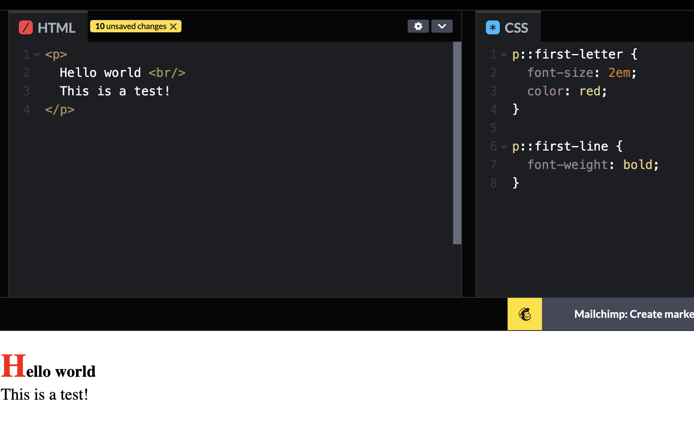
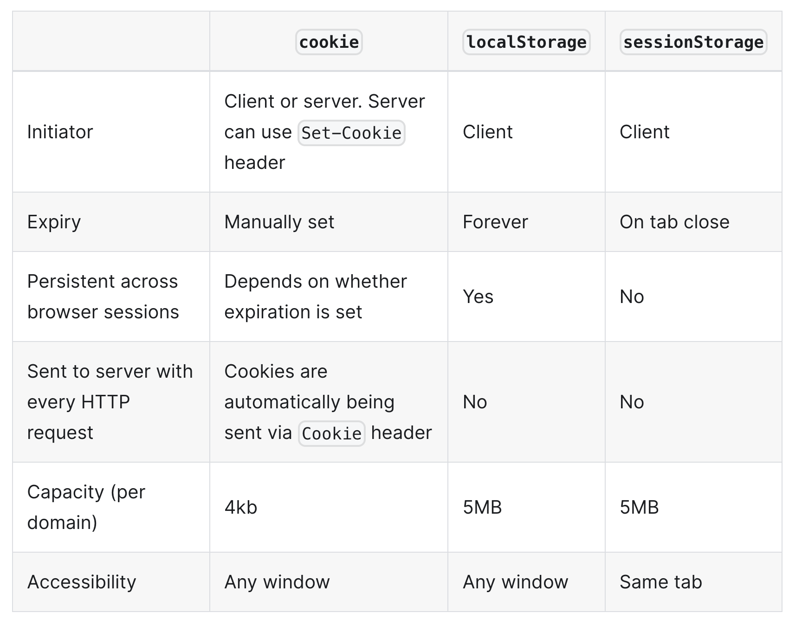

# JS: What's a typical use case for anonymous functions?

- callback
- arrow function
- IIFEs

# JS: What's the difference between host objects and native objects?

- Native objects: are objects that are part of the JavaScript language
- Host objects: are provided by the runtime environment (browser or Node)

# JS: Difference between: function Person(){}, var person = Person(), and var person = new Person()?

`function Person(){}`
- declarition of a fucntion named 'Person', normally use PascalCase for function intended to be used as constructor

`var person = Person()`
- invokes Person() as a function
- person is anything returned by Person(), normally return nothing, so the value is `undefined`

`var person = new Person()`
- create an instance of Person by calling Person as a constructor
- the new object inherits Person.prototype
- inherits alternative:
  - Object.create (Avoid, low performace)
  - Object.setPrototypeOf

# What's the difference between .call and .apply?

Both are used to invoke a function with given object, the `this` will be bind to that object

Difference: syntax

obj offer the `this` context

* Function.prototype.call(obj, arg1, arg2, ...) // take comma-separated arguments
* Function.prototype.apply(obj, [arg1, arg2, ...] ) // take an array of arguments
---
* C for call and comma-separated and 
* A for apply and an array of arguments.

# Explain Function.prototype.bind.

Calling `f.bind(someObject)` creates a new function with the same body and scope as f, but the value of this is permanently bound to the first argument of bind, regardless of how the function is being called.

- 创建一个拥有相同body和scope的函数
- 这个函数的this永远绑定到指定object

it is most useful for binding the value of `this` in methods of classes that you want to pass into other functions. This is frequently done in React components.

# What's the difference between feature detection, feature inference, and using the UA string?

**Feature detection** involves working out whether a browser supports a certain block of code, and running different code depending on whether it does (or doesn't), so that the browser can always provide a working experience rather crashing/erroring in some browsers.

**Feature inference** checks for a feature just like feature detection, but uses another function because it assumes it will also exist

Feature inference is assuming that because you've detected one feature that you can use other features.

通过确定它支持某个feature，从而确定另一个它也支持
```js
if (document.getElementsByTagName) {
  element = document.getElementById(id);
}
```

**US string** 
- it contains application, OS, software vendor/vender information for user agent while accessing the web.
- client-sider: can be accessed through `navigator.userAgent`
- server-side: can be accessed through reauest header: `User-Agent`

The usage depends on the usage senarios
- If the feature can be detected use Feture detection, should be the first choice over Feature Inference
- Should also avoid US string if can be achived by Feture detection
  - Shoule keep all broswers same behavior. 
    - Check if touchable
    - Check screen size
  - Only if some device/broswer specific issues

> **❤️️ MSTR example** <br>
> Viewport size change latency
> - We need to increace the viewport size detection for a certain latency
> - The latency dependes on devie/network/software version, we achieve dynamic latency adjustment
>   - Let's say we set the timeout 550ms, interval 50ms
>   - size changes detected within 550ms, reset timeout
>   - no changes detected within 550ms, size is stable

# JS: Explain Ajax in as much detail as possible.

- Ajax (asynchronous JavaScript and XML) is a set of web development techniques using many web technologies on the client side to create asynchronous web applications.
- With Ajax, web applications can send data to and retrieve from a server asynchronously (in the background) without interfering with the display and behavior of the existing page. 
- By decoupling the data interchange layer from the presentation layer, Ajax allows for web pages, and by extension web applications, to change content dynamically without the need to reload the entire page. 
- In practice, modern implementations commonly use JSON instead of XML, due to the advantages of JSON being native to JavaScript.

# What are the advantages and disadvantages of using Ajax?
Advantages
* Better interactivity. 
  * New content from the server can be changed dynamically without the need to reload the entire page.
* Reduce connections to the server 
  * since scripts and stylesheets only have to be requested once.
* State can be maintained on a page. 
  * JavaScript variables and DOM state will persist because the main container page was not reloaded.
* Basically most of the advantages of an SPA.

Disadvantages
* Dynamic webpages are harder to bookmark.
* Does not work if JavaScript has been disabled in the browser.
* Some webcrawlers do not execute JavaScript and would not see content that has been loaded by JavaScript.
* Webpages using Ajax to fetch data will likely have to combine the fetched remote data with client-side templates to update the DOM. For this to happen, JavaScript will have to be parsed and executed on the browser, and low-end mobile devices might struggle with this.
* Basically most of the disadvantages of an SPA.

# Have you ever used JavaScript templating? If so, what libraries have you used?

- JavaScript templating refers to the practice of using templates to generate dynamic HTML content or other text-based formats in JavaScript applications. 
- Templating allows you to separate the structure of the content from the logic that generates it, making it easier to manage and update.

- In JavaScript templating, you typically define a template that includes placeholders or variables representing dynamic data. These placeholders are then replaced with actual values at runtime, resulting in a final rendered output

ES2015 introduced backtick ` for Template literals.

JSX is a syntax extension for JavaScript that lets you write HTML-like markup inside a JavaScript file.
```js
const name = "John";
const element = <h1>Hello, {name}!</h1>;
```

# JS： Explain "hoisting".

JavaScript Hoisting refers to the process whereby the interpreter appears to move the declaration of functions, variables, classes, or imports to the top of their scope, prior to execution of the code.

The declaration is not actually moved - the JavaScript engine parses the declarations during compilation and becomes aware of declarations and their scopes. 

Variable Hoisting(normally refering to `var`):
- When a variable is hoisted, only the declaration is moved to the top, not the initialization. This means that the variable is created in memory but is assigned the value of undefined until the assignment statement is encountered during runtime.
```js
console.log(myVariable); // Output: undefined
var myVariable = 10;
```

- Whether let and const are hoisted is a matter of definition debate. Referencing the variable in the block before the variable declaration always results in a ReferenceError, because the variable is in a "temporal dead zone" from the start of the block until the declaration is processed.
```js
console.log(x); // ReferenceError
const x = 3;

console.log(y); // ReferenceError
let y = 3;
```

Function Hoisting:
- Function declarations are fully hoisted, meaning both the declaration and the function body are moved to the top of the scope. This allows you to call a function before it appears in the code.
- However, it's important to note that function expressions, such as those assigned to variables using const, let, or var, are not hoisted.
```js
// Function Declaration
console.log(foo); // [Function: foo]
foo(); // 'FOOOOO'
function foo() {
  console.log('FOOOOO');
}
console.log(foo); // [Function: foo]

// Function Expression
console.log(bar); // undefined
bar(); // Uncaught TypeError: bar is not a function
var bar = function () {
  console.log('BARRRR');
};
console.log(bar); // [Function: bar]
```

# JS: Describe event bubbling.

Event fired at inner element, bubble up to nested outer elements. It's helpful when we need to handling many similar actions/events, we can handle it from parent componnets. We can also use stopPropagation to stop the bubbling in the callback.

When an event triggers on a DOM element, it will attempt to handle the event if there is a listener attached, then the event is bubbled up to its parent and the same thing happens. This bubbling occurs up the element's ancestors all the way to the document. Event bubbling is the mechanism behind event delegation.

# JS: What's the difference between an "attribute" and a "property"?

Attributes are defined on the HTML markup but properties are defined on the DOM. 

```js
const input = document.querySelector('input');
console.log(input.getAttribute('value')); // Hello (attribute: value)
console.log(input.value); // Hello (property: value)
```

# JS: Why is extending built-in JavaScript objects not a good idea?

- Risk of Collisions
  - There is a possibility that a future JavaScript update or another library might introduce a method or property with the same name but with different behavior.
- Compatibility Issues
- Code Maintainability
  - It can also make debugging more difficult since the behavior of built-in objects is modified
- Breaking Encapsulation
  - each object should have a well-defined and limited set of responsibilities. By adding methods or properties to built-in objects, you are mixing unrelated functionalities and increasing the complexity of your code.
- Performance Impact
  - Modifying built-in objects can affect the performance of the JavaScript engine's built-in optimizations. 

Instead of extending built-in objects, it is generally recommended to create utility functions or separate objects that encapsulate the desired functionality. 

# JS: Difference between document load event and document DOMContentLoaded event?

load event
- fires when the page loaded, including all dependent resources and assets

DOMContentLoaded event
- fires when the HTML get loaded and parsed, won't wait for resources

# JS: What is the difference between == and ===?

== 
- is the abstract equality operator 
- compare for equality after doing any necessary type conversions
- `==` is helpful when:
  - want to treat null and undefined the same

=== 
- is the strict equality operator
- not do type conversion
- always considers operands of different types to be different.
- Better use `===` all the time

# JS: Explain the same-origin policy with regards to JavaScript.
The same-origin policy prevents JavaScript from making requests across domain boundaries. An origin is defined as a combination of URI scheme, hostname, and port number. This policy prevents a malicious script on one page from obtaining access to sensitive data on another web page through that page's Document Object Model.

# What is "use strict";? What are the advantages and disadvantages to using it?
'use strict' (introduced in ECMAScript 5 ) is a statement used to enable strict mode to entire scripts or individual functions. Strict mode is a way to opt into a restricted variant of JavaScript.

Advantages
- Enhanced Error Handling
- Elimination of Silent Errors
  -  reducing the chances of creating unintended global variables.
- Restricted Use of Reserved Keywords
- More Secure JavaScript
  - disallows certain unsafe or deprecated features: eg. it prevents the use of this in the global scope, which can lead to accidental modification of the global object.

Advantages:
* Makes it impossible to accidentally create global variables.
* Makes assignments which would otherwise silently fail to throw an exception.
  * eg, assign to non-writable variable
  * eg, `undefined = 5; // TypeError`
* Makes attempts to delete undeletable properties throw an exception (where before the attempt would simply have no effect).
  * eg, `delete Object.prototype; // TypeError`
* Requires that function parameter names be unique.
* this is undefined in the global context.
* It catches some common coding bloopers, throwing exceptions.
* It disables features that are confusing or poorly thought out.


Disadvantages
- Backward Compatibility
- Stricter Syntax Requirements
- Potential Performance Impact
  - due to the additional checks and validations
  -  the impact is generally negligible in modern JavaScript engines.
-  

# JS: Why is it, in general, a good idea to leave the global scope of a website as-is and never touch it?
Every script has access to the global scope, and if everyone uses the global namespace to define their variables, collisions will likely occur. Use the module pattern (IIFEs) to encapsulate your variables within a local namespace.

# JS: Explain what a single page app is and how to make one SEO-friendly.

Traditionally, it's server-side rendering, we load documents from server for each page and render it.

Modern modern SPAs, we use client-side rendering.
- The browser loads the initial page from the server, along with the scripts (frameworks, libraries, app code) and stylesheets required for the whole app. 
- When the user navigates to other pages, a page refresh is not triggered. 
- The URL of the page is updated via the HTML5 History API
- New data required for the new page, usually in JSON format, is retrieved by the browser via AJAX requests to the server. 
- The SPA then dynamically updates the page with the data via JavaScript, which it has already downloaded in the initial page load.

The benefits:
* The app feels more responsive and users do not see the flash between page navigations due to full-page refreshes.
* Fewer HTTP requests are made to the server, as the same assets do not have to be downloaded again for each page load.
* Clear separation of the concerns between the client and the server; you can easily build new clients for different platforms (e.g. mobile, chatbots, smart watches) without having to modify the server code. You can also modify the technology stack on the client and server independently, as long as the API contract is not broken.

The downsides:
* Heavier initial page load due to the loading of framework, app code, and assets required for multiple pages.
* ❓❓❓There's an additional step to be done on your server which is to configure it to route all requests to a single entry point and allow client-side routing to take over from there.
* SPAs are reliant on JavaScript to render content, but not all search engines execute JavaScript during crawling, and they may see empty content on your page. This inadvertently hurts the Search Engine Optimization (SEO) of your app. However, most of the time, when you are building apps, SEO is not the most important factor, as not all the content needs to be indexable by search engines. To overcome this, you can either server-side render your app or use services such as Prerender to "render your javascript in a browser, save the static HTML, and return that to the crawlers".

[SEO](https://searchengineland.com/guide/what-is-seo)

# JS: What is the extent of your experience with Promises and/or their polyfills?
The `Promise` objects represents the evenetual completion (or failure) of an asynchronous operation and its resulting value.

It has 3 states: fullfiled, rejected, pending

Their handler can be chained, the attched callbacks will be executed once the promise settled.

It offers several static functions for concurency.
- Promise.all -> all fullfiled
- Promise.any -> any fullfiled
- Promise.allSettled -> all settled
- Promise.race -> any settled

Can be canceled thorugh AbortController

# JS: What are the pros and cons of using Promises instead of callbacks?

Pros
- Readability:
  - Promises allow for a more linear and sequential flow of code, making it easier to understand and maintain. 
  - Callbacks, especially when nested, can lead to callback hell, where the code becomes difficult to read and follow.
- Error handling: 
  - Promises have built-in error handling mechanisms, such as the .catch() method, which makes it easier to catch and handle errors in a centralized manner. 
  - Callbacks, on the other hand, require explicit error handling within each callback function, leading to more complex and error-prone code.
- Chaining: 
  - Promises allow for easy chaining of asynchronous operations using the .then() method. This enables a more modular and reusable code structure, where each asynchronous operation can be handled separately and sequentially. 
  - Callbacks, on the other hand, require nesting of multiple callbacks, which can make the code harder to read and maintain.
- Composition: 
  - Promises can be easily composed and combined using methods like Promise.all() and Promise.race(). These methods allow for handling multiple Promises simultaneously, either waiting for all Promises to resolve or resolving as soon as any Promise in the group resolves. 
  - Achieving similar composition with callbacks would require more complex code and management of multiple callbacks.

Cons
- Browser compatibility
  - In older browsers where ES2015 is not supported, you need to load a polyfill in order to use it.
- Performance overhead: 
  - Promises have a slight performance overhead compared to callbacks, as they involve additional internal logic for handling asynchronous operations.

# JS: What are some of the advantages/disadvantages of writing JavaScript code in a language that compiles to JavaScript?

Advantages
- Enhanced language features:
  - Languages that compile to JavaScript, like TypeScript often offer additional language features that are not available in plain JavaScript. These features can improve code readability, maintainability, and productivity.
- Type checking: 
  - Many compiled languages provide **static type checking**, which helps catch type-related errors during development. This can lead to more reliable and bug-free code, as type errors are caught at compile-time rather than runtime.
- Improved tooling and IDE support: 
  - Compiled languages often have better tooling and IDE support, including code completion, refactoring tools, and better error reporting. This can enhance developer productivity and make it easier to write and maintain code. 
- Compatibility with older JavaScript versions: 
  - Some compiled languages can target older versions of JavaScript, allowing you to write modern code while still supporting older browsers or platforms that do not have full ECMAScript support.
- Easier integration with existing JavaScript codebases: 
  - Compiled languages are designed to seamlessly integrate with existing JavaScript codebases, making it easier to gradually adopt the new language features without rewriting the entire codebase.

Disadvantages
- Learning curve: 
  - Using a language that compiles to JavaScript may require learning new syntax, concepts, and tooling. This can have a learning curve and may slow down development initially.
- Build process complexity: 
  - Browser only browsers only run JavaScript, need extra compile and build process
  - Compiling a language to JavaScript often involves an additional build step, which adds complexity to the development process. This includes setting up build tools, configuring the compilation process, and managing dependencies.
- Debugging challenges: 
  - Debugging code that has been compiled from another language can be more challenging, as the generated JavaScript code may not directly correspond to the original source code. This can make it harder to trace issues and understand the root cause of bugs.
- Dependency on the compiler: 
  - Using a language that compiles to JavaScript means relying on the compiler and its ecosystem. This introduces a dependency on the compiler's development, maintenance, and support, which may impact the long-term viability of the codebase.
- These languages will always be behind the latest JavaScript standard.

# JS: What language constructions do you use for iterating over object properties and array items?

> **_NOTE:_** <br>
"Language constructions": refer to the various syntax and features provided by a programming language that allow you to perform specific tasks or achieve certain functionality. These language constructions are built-in and predefined in the language itself and provide a way to express different programming concepts and operations.

For objects
- `for (var property in obj) { console.log(property); }`
  - However, this will also iterate through its inherited properties, and you will add an obj.hasOwnProperty(property) check before using it.
- `Object.keys(obj).forEach(function (property) { ... }).`
  - Object.keys() is a static method that will lists all enumerable properties of the object that you pass it.
- `Object.getOwnPropertyNames(obj).forEach(function (property) { ... }).`
  - Object.getOwnPropertyNames() is a static method that will lists all enumerable and non-enumerable properties of the object that you pass it.

For arrays
- `for` loops
  - if you need the index
  - you want to be able to break the loop
- `forEach`
  - you only care about the item
- `for-of` (ES2015)
  - you only care about the item
  - you want to be able to break the loop
  - to access index
    - `for (let [index, elem] of arr.entries()) `

# JS: Explain the difference between mutable and immutable objects.

Mutable Objects: 
- Mutable objects are objects whose state or data can be modified after they are created. In other words, you can change their properties, add or remove elements, or modify their internal state without creating a new object. 
- Examples of mutable objects in JavaScript include 
  - arrays ([]), 
  - objects ({}), 
  - and the `Map` 
  - and `Set` data structures.

Immutable Objects: 
- Immutable objects, on the other hand, are objects whose state cannot be changed after they are created. Once an immutable object is created, its properties and values cannot be modified. 
- Instead, any operation that appears to modify an immutable object actually creates a new object with the desired changes. 
- Examples of immutable objects in JavaScript include 
  - strings ('hello'), 
  - numbers (42), 
  - and the `Date` object.

The concept of immutability is often associated with functional programming paradigms, as immutable objects help ensure data integrity, simplify code reasoning, and enable better concurrency control. Immutable objects are also useful for scenarios where you want to preserve the original state or create predictable and reliable code.

# JS: Object Constant Properties

- Using `Object.defineProperty()`: 通过参数创建不变量
```js
const obj = {}

Object.defineProperty(obj, 'CONSTANT_PROP', {
  value: 'constant value',
  writable: false,
  enumerable: true,
  configurable: false,
});

console.log(obj.CONSTANT_PROP) // before deletion: constant value
delete obj.CONSTANT_PROP
console.log(obj.CONSTANT_PROP) // after deletion: constant value
```

- Using `Object.freeze()`: 禁止一切改动
```js
const obj = Object.freeze({
  CONSTANT_PROP: 'constant value',
});

console.log(obj.CONSTANT_PROP); // Output: 'constant value'
obj.CONSTANT_PROP = 'modified value'; // This assignment will be ignored in strict mode or throw an error in non-strict mode
console.log(obj.CONSTANT_PROP); // Output: 'constant value'
```

- `Object.preventExtensions()`: This method prevents any extensions (addition of new properties) to an object. While existing properties can still be modified or deleted, no new properties can be added. (不允许添加新properties, 允许现有properties的的删，改)
```js
const obj = {
  prop1: 'value1',
  prop2: 'value2',
};

Object.preventExtensions(obj);

obj.prop2 = 'value2'; // This addition will be ignored in strict mode or throw an error in non-strict mode
console.log(obj.prop2); // Output: undefined

obj.prop1 = 'modified value'; // Existing properties can still be modified
console.log(obj.prop1); // Output: 'modified value'

console.log(obj.prop2); // before deletion: value2
delete obj.prop2
console.log(obj.prop2); // after deletion: undefined
```
- `Object.seal():` The Object.seal() method seals an object by preventing the addition, deletion, or configuration of properties. Existing properties can still be modified. (禁止properties的添加，删除，配置，允许现有properties值的修改)

# JS: What are the pros and cons of immutability?

Pros of immutability:

* Predictability: (值不变，可预测)
  * Immutable objects have a fixed state that cannot be changed after creation. This predictability makes it easier to reason about the behavior of the code and reduces the risk of unexpected side effects.

* Simplified debugging: （值不变，不用检查那些操作会改变这个object）
  * Since immutable objects cannot be modified, debugging becomes easier. Once an immutable object is created, its state remains constant, eliminating the need to track down and debug changes made to the object.

* Concurrency and parallelism: （天生thread-safe）
  * Immutable objects are inherently thread-safe, as multiple threads or processes can access them simultaneously without the risk of race conditions or conflicts. This property makes immutability well-suited for concurrent and parallel programming.

* Performance optimizations: （可以利用它来优化performace）
  * Immutable data structures can be optimized for performance. Techniques like structural sharing and memoization can be employed to reuse existing immutable objects, reducing memory usage and improving performance.

Using immutable data structures: ensures that the memo object remains unchanged throughout the recursive calls
```js
function fibonacci(n, memo = {}) {
  if (n <= 1) {
    return n;
  }

  if (memo[n]) {
    return memo[n];
  }

  const result = fibonacci(n - 1, memo) + fibonacci(n - 2, memo);
  memo[n] = result;
  return result;
}

console.log(fibonacci(10)); // Output: 55
```

* Functional programming benefits: 
  * Immutability is a fundamental principle in functional programming. Immutable objects align well with functional programming concepts like pure functions, referential transparency, and easy composition, enabling code that is more modular, testable, and maintainable.

Cons of immutability:

* Memory overhead: （拷贝它需要更多内存）
  * Immutable objects, especially when used extensively, can consume more memory compared to mutable objects. This is because creating a modified copy of an immutable object requires allocating memory for the new object, rather than modifying the existing object in place.

* Performance impact for large objects: （拷贝大数据需要更多时间）
  * In scenarios where large objects need to be modified frequently, the overhead of creating new copies of the object can impact performance. In such cases, mutable objects might provide better performance.

* Learning curve and code complexity: 
  * Adopting immutability requires a shift in programming mindset and may introduce additional complexity, especially for developers who are not familiar with functional programming concepts. Writing code with immutability in mind may initially require more effort and understanding.

* Object creation overhead: 
  * Creating new immutable objects for every modification can introduce additional overhead, especially for small and short-lived objects. In some cases, mutable objects might be more efficient and performant.

* Interoperability with mutable code: 
  * Immutability can be challenging when working with existing code or libraries that heavily rely on mutable objects. Integrating immutable code with mutable codebases may require additional considerations and careful handling of data transformations.

# JS: How can you achieve immutability in your own code?

- Use `const` for variable declarations
- Avoid modifying existing objects or arrays:
  - Use methods like `Object.assign()`
  - spread syntax `(...)`
  - array methods to create new copies with modifications. 
    - concat(), 
    - slice(), or 
    - map()
- Use immutable data structure: 
  -  Immutable data structures, such as those provided by libraries like Immutable.js or Immer,
- Prefer pure functions: Write functions that do not modify their arguments or any external state. Pure functions take input and produce output without causing side effects, making them inherently immutable and easier to reason about.

# JS: Explain the difference between synchronous and asynchronous functions.

Synchronous functions are blocking while asynchronous functions are not. In synchronous functions, statements complete before the next statement is run. In this case, the program is evaluated exactly in order of the statements and execution of the program is paused if one of the statements take a very long time.

Asynchronous functions usually accept a callback as a parameter and execution continue on the next line immediately after the asynchronous function is invoked. The callback is only invoked when the asynchronous operation is complete and the call stack is empty. Heavy duty operations such as loading data from a web server or querying a database should be done asynchronously so that the main thread can continue executing other operations instead of blocking until that long operation to complete (in the case of browsers, the UI will freeze).

# JS: What is event loop? What is the difference between call stack and task queue?

Event loop is a single-threaded loop which continusly check the call stack and task queue.

1. Process call stack until it's empty
2. Process next task from queue, push to call back for execution
   1. During which, a promise resolved, and added to microtasks queue
   2. Done with current task, process all microtasks
   3. Done with microtasks, next task

# JS: Explain the differences on the usage of foo between function foo() {} and var foo = function() {}

function foo() {}
- function declaration

foo = function() {}
- function expression

The key difference is that function declarations have its body hoisted but the bodies of function expressions are not 


# JS: What are the differences between variables created using let, var or const?

var
- scoped to the function
- if created outside of any function, to the global object
- allows variables to be hoisted
  -  meaning they can be referenced in code before they are declared
-  Redeclaring a variable with var will not throw an error
```
var foo = 'foo';
var foo = 'bar';
console.log(foo); // "bar"

let baz = 'baz';
let baz = 'qux'; // Uncaught SyntaxError: Identifier 'baz' has already been declared
```

let / const
- block scope
- only accessible within the nearest set of curly braces
  - function, 
  - if-else block, 
  - or for-loop
- not allow hoisting

let
- allow reassigning 

const 
- not allow reassigning 

# JS: What are the differences between ES6 class and ES5 function constructors?

* Syntax: 
  * ES6 classes have a more concise and intuitive syntax compared to ES5 function constructors. 
  * Classes use the class keyword, while function constructors use regular functions.

* Inheritance: 
  * ES6 classes support built-in inheritance using the extends keyword, allowing for easier and cleaner code organization. 
  * ES5 function constructors require manual prototypal inheritance using the prototype property.

* Super keyword: 
  * ES6 classes have the super keyword, which allows for calling the parent class's constructor and methods. 
  * ES5 function constructors do not have a built-in equivalent for this functionality.

* Static methods: 
  * ES6 classes support static methods, which are methods that belong to the class itself rather than its instances. 
  * ES5 function constructors do not have native support for static methods.

* Getter and setter methods: 
  * ES6 classes have built-in support for getter and setter methods, allowing for more controlled access to class properties. 
  * ES5 function constructors do not have native support for these methods.

* Strict mode: 
  * ES6 classes are automatically in strict mode, 
  * while ES5 function constructors are not. 
  * Strict mode enforces stricter rules and helps catch common programming mistakes.

# JS: Can you offer a use case for the new arrow => function syntax? How does this new syntax differ from other functions?
- simplify the syntax needed to create functions
- The this within arrow functions is also bound to the enclosing scope which is different compared to regular functions where the this is determined by the object calling it. 
  - Lexically-scoped this is useful when invoking callbacks especially in React components.

Chat-gpt
* Lexical this binding: 
  * Arrow functions do not bind their own this value but instead inherit it from the enclosing scope. 
  * This behavior can be particularly useful when working with callbacks or nested functions, as it eliminates the need to use .bind() or create a reference to this using self or that.

```js
class MyComponent extends React.Component {
  handleClick() {
    // Access component state or props using 'this'
    console.log(this.state.value);
  }

  render() {
    return (
      <button onClick={this.handleClick.bind(this)}>Click me</button>
    );
  }
}
```

For following code,
innerFunction `this` = outerFunction's `this` = global object (window) (if executed in a browser environment, regardless of strict mode)


arrow function 'inherit' lexical scope `this`

```js
const outerFunction = () => {
  const innerFunction = () => {
    // 'this' inside the arrow function refers to the 'outerFunction'
    console.log(this);
  };

  innerFunction();
};

function normalFunc() {
  console.log(this);
}

outerFunction(); // prints global object (window)
normalFunc(); // prints undefined
```

* No arguments object: 
  * Arrow functions do not have their own arguments object. Instead, they inherit the arguments object from the enclosing scope. This can simplify code and prevent confusion when dealing with function parameters.

```js
function example() {
  const arrowFunc = () => {
    console.log(arguments);
  };
  
  arrowFunc(1, 2, 3);
}

example(4, 5, 6); // print 4,5,6
```

* No new keyword: 
  * Arrow functions cannot be used as constructors and do not have their own prototype property. 
  * Therefore, they cannot be used with the new keyword to create instances of objects.

* Implicit return: 
  * If an arrow function has a single expression, it can be written without curly braces. The result of that expression will be implicitly returned. 
  * This shorthand syntax can make code more concise and readable.

# JS: What is the definition of a higher-order function?

A higher order function(HOF) is a function 
- that takes one or more functions as arguments, 
- or returns a function as its result

```js
function doSomething(callback) {
  // Perform some task
  console.log('Doing something...');

  // Invoke the callback function
  callback();
}

function callbackFunction() {
  console.log('Callback executed!');
}

// Pass the callback function to the higher-order function
doSomething(callbackFunction);
```

```js
const transformNamesToUppercase = function (names) {
  return names.map((name) => name.toUpperCase());
};
transformNamesToUppercase(names); // ['IRISH', 'DAISY', 'ANNA']
```

# JS: examples for destructuring

Destructuring array
```js
const numbers = [1, 2, 3, 4, 5];

// Extracting individual elements
const [first, , third, , fifth] = numbers;
console.log(first);   // Output: 1
console.log(third);  // Output: 3
console.log(fifth);  // Output: 5

// Swapping variables
let a = 10;
let b = 20;
[a, b] = [b, a];
console.log(a);  // Output: 20
console.log(b);  // Output: 10
```

Destructuring object
```js
const person = {
  name: 'John Doe',
  age: 30
};

// Destructuring with new name
// Destructuring with Default Values
const { name: personName, occupation = 'Unemployed', age } = person;
console.log(personName);        // Output: John Doe
console.log(occupation);  // Output: Unemployed
console.log(age);        // Output: 30
```

Destructuring Function Parameters
```js
function printName({ firstName, lastName = 'yang' }) {
  console.log(`First Name: ${firstName}`);
  console.log(`Last Name: ${lastName}`);
}

const person = {
  firstName: 'John',
  lastName: 'Doe'
};

printName(person);
// Output:
// First Name: John
// Last Name: Doe
```


# JS: ES6 Template Literals offer a lot of flexibility in generating strings, can you give an example?

Template literals 
- are literals delimited with backtick (`) characters, 
- allowing for multi-line strings, 
- string interpolation with embedded expressions, 
- and special constructs called tagged templates.

```js
`string text`

`string text line 1
 string text line 2`

`string text ${expression} string text`

tagFunction`string text ${expression} string text`
```

Another use case of template literals would be to use as a substitute for templating libraries for simple variable interpolations:
```js
const person = { name: 'Tyler', age: 28 };
document.body.innerHTML = `
  <div>
    <p>Name: ${person.name}</p>
    <p>Age: ${person.age}</p>
  </div>
`;
```


# JS: Can you give an example of a curry function and why this syntax offers an advantage?

currying is breaking down a function into a series of functions that each a single argument.

Currying is a transformation of functions that translates a function from callable as f(a, b, c) into callable as f(a)(b)(c).

Currying doesn’t call a function. It just transforms it.

an exmaple is lodash `_.curry()`
```js
function log(date, importance, message) {
  alert(`[${date.getHours()}:${date.getMinutes()}] [${importance}] ${message}`);
}

log = _.curry(log);

log(new Date(), "DEBUG", "some debug"); // log(a, b, c)
log(new Date())("DEBUG")("some debug"); // log(a)(b)(c)

// logNow will be the partial of log with fixed first argument
let logNow = log(new Date());

// use it
logNow("INFO", "message"); // [HH:mm] INFO message
```

Simulate `_.curry()`
```js

function curry(func) {
  return function curried(...args) {
    if (args.length >= func.length) {
      return func.apply(this, args);
    } else {
      return function(...args2) {
        return curried.apply(this, args.concat(args2));
      }
    }
  };

}

function curry2(func) {
    const curried = (...args) =>  {
        if (args.length >= func.length) {
          return func(...args);
        } else {
          return (...args2) =>  {
            return curried(...args.concat(args2));
          }
        }
    };
  
  return curried
}

const sum2 = (a, b, c) => {
  return a + b + c;
}

function sum(a, b, c) {
  return a + b + c;
}

let curriedSum = curry2(sum);
alert( curriedSum(1, 2, 3) ); // 6, still callable normally
alert( curriedSum(1)(2,3) ); // 6, currying of 1st arg
alert( curriedSum(1)(2)(3) ); // 6, full currying
```

# JS: What are the benefits of using spread syntax and how is it different from rest syntax?

Spread syntax `...`
- Especially helpful when creating new objects
```js
// Array
function putDookieInAnyArray(arr) {
  return [...arr, 'dookie'];
}
const result = putDookieInAnyArray(['I', 'really', "don't", 'like']); // ["I", "really", "don't", "like", "dookie"]

// Object
const person = {
  name: 'Todd',
  age: 29,
};
const copyOfTodd = { ...person };
```
Rest syntax `...`
- inverse of the spread syntax, taking data and stuffing it into an array rather than unpacking an array of data

```js
// Function arguments
function addFiveToABunchOfNumbers(...numbers) {
  return numbers.map((x) => x + 5);
}
const result = addFiveToABunchOfNumbers(4, 5, 6, 7, 8, 9, 10); // [9, 10, 11, 12, 13, 14, 15]

// Array destructuring assignments.
const [a, b, ...rest] = [1, 2, 3, 4]; // a: 1, b: 2, rest: [3, 4]

// Object destructuring assignments.
const { e, f, ...others } = {
  e: 1,
  f: 2,
  g: 3,
  h: 4,
}; // e: 1, f: 2, others: { g: 3, h: 4 }
```

# JS How can you share code between files?
This depends on the JavaScript environment.

On the client (browser environment), as long as the variables/functions are declared in the global scope (window), all scripts can refer to them. Alternatively, adopt the Asynchronous Module Definition (AMD) via RequireJS for a more modular approach.

On the server (Node.js), the common way has been to use CommonJS. Each file is treated as a module and it can export variables and functions by attaching them to the module.exports object.

ES2015 defines a module syntax which aims to replace both AMD and CommonJS. This will eventually be supported in both browser and Node environments.

# JS：Why might you want to create static class members?
Static class members (properties/methods) are not tied to a specific instance of a class and have the same value regardless of which instance is referring to it. Static properties are typically configuration variables and static methods are usually pure utility functions which do not depend on the state of the instance.

# 1 CSS: What is CSS selector specificity and how does it work?
CSS selector specificity is a mechanism that determines which CSS rule takes precedence when multiple rules target the same element. It is used to resolve conflicts and determine which styles should be applied to an element when there are conflicting rules.

CSS selector specificity is based on the specificity value assigned to each selector. The specificity value is calculated using a set of rules:

* Inline styles: -> 1000
  * An inline style has the highest specificity value. 
  * It is defined directly on the element using the style attribute.
  * `<h1 style="color: #fff;">`

* ID selectors: -> 100 for each
    * ID selectors have a higher specificity value than class selectors or tag selectors. They are denoted by the # symbol followed by the ID name.
    * `#myID`

* Class selectors, attribute selectors, and pseudo-classes: -> 10 for each
  * Class selectors, attribute selectors, and pseudo-classes have a lower specificity value than ID selectors. 
  * They are denoted by the 
    * . symbol for classes: `.class`
    * square brackets for attribute selectors: `[attribute]`
    * or a colon for pseudo-classes: `:hover`

* Element selectors and pseudo-elements: -> 1 for each
  * Element selectors and pseudo-elements have the lowest specificity value. They target elements by 
    * their tag name or : `a` `p`
    * using double colons (::) for pseudo-elements: `::before`

Will look like a 4 digital: a,b,c,d -> 0,1,0,0 if ID matched
`body #content .data img:hover` -> 0,1,2,2 or 0122

I would write CSS rules with low specificity so that they can be easily overridden if necessary. 


```css
/* ID selectors */
#myId {}

/* class selectors */
.myClassName {}

/* attribute selectors */
a[title] {}

/* pseudo-classes */
button:hover {}

/* element selectors */
a {}

/* pseudo-elements */
p::first-line {}
p::before {}
```
# 2 CSS: What's the difference between "resetting" and "normalizing" CSS? Which would you choose, and why?
Resetting - Resetting is meant to strip all default browser styling on elements. For e.g. margins, paddings, font-sizes of all elements are reset to be the same. You will have to redeclare styling for common typographic elements.
Normalizing - Normalizing preserves useful default styles rather than "unstyling" everything. It also corrects bugs for common browser dependencies.

# 3 CSS: Describe floats and how they work.

Float is a CSS positioning property. Floated elements remain a part of the flow of the page, and will affect the positioning of other elements (e.g. text will flow around floated elements), unlike position: absolute elements, which are removed from the flow of the page.

The CSS clear property can be used to be positioned below left/right/both floated elements.

decription
- taken out of the normal flow, 
- but still in the flow, affect other components positioning
- shifted to left/right until touch the edge

vs
- unlike position: absolute which is removed from the flow

clear
- use this to position element under floated elements

special
- if contains only floats, the container has 0 height
- hack 1
```css
.clearfix::after {
  content: ' ';
  visibility: hidden;
  display: block;
  height: 0;
  clear: both;
}
```
- hack 2: establish a new block formatting context (give overflow: auto or overflow: hidden property to the parent element )

# 4 CSS: Describe z-index and how stacking context is formed.

**z-index**

The z-index property in CSS controls the vertical stacking order of elements that overlap. z-index only affects elements that have a position value which is not static.

**how stacking context is formed**

Without any z-index value, elements are stacked in the following order (from bottom to top):
* The background and borders of the root element.
* Descendant non-positioned elements, in order of appearance in the HTML.
* Descendant positioned elements, in order of appearance in the HTML.

A stacking context is an element that contains a set of layers. Within a local stacking context, the z-index values of its children are set relative to that element rather than to the document root.

# 5 CSS: Describe Block Formatting Context (BFC) and how it works.
A Block Formatting Context (BFC) is part of the visual CSS rendering of a web page in which block boxes are laid out. Floats, absolutely positioned elements, inline-blocks, table-cells, table-captions, and elements with overflow other than visible (except when that value has been propagated to the viewport) establish new block formatting contexts.

Knowing how to establish a block formatting context is important, because without doing so, the containing box will not contain floated children. This is similar to collapsing margins, but more insidious as you will find entire boxes collapsing in odd ways.

A BFC is an HTML box that satisfies at least one of the following conditions:

* The value of float is not none.
* The value of position is neither static nor relative.
* The value of display is table-cell, table-caption, inline-block, flex, or inline-flex, grid, or inline-grid.
* The value of overflow is not visible.
* In a BFC, each box's left outer edge touches the left edge of the containing block (for right-to-left formatting, right edges touch).

Vertical margins between adjacent block-level boxes in a BFC collapse. 

# 6 CSS: Explain CSS sprites, and how you would implement them on a page or site.
CSS sprites combine multiple images into one single larger image. It is a commonly-used technique for icons (Gmail uses it). How to implement it:

Use a sprite generator that packs multiple images into one and generate the appropriate CSS for it.
Each image would have a corresponding CSS class with background-image, background-position and background-size properties defined.
To use that image, add the corresponding class to your element.
Advantages:

Reduce the number of HTTP requests for multiple images (only one single request is required per spritesheet). But with HTTP2, loading multiple images is no longer much of an issue.
Advance downloading of assets that won't be downloaded until needed, such as images that only appear upon :hover pseudo-states. Blinking wouldn't be seen.

# 7 CSS: What are the different ways to visually hide content (and make it available only for screen readers)?

- CSS display property:
- CSS visibility property
- CSS position and clip properties
```css
.visually-hidden {
  position: absolute;
  clip: rect(0 0 0 0);
}
```
- CSS text-indent property
```css
.visually-hidden {
  text-indent: -9999px; /* the text is moved off-screen*/
}
```
- ARIA hidden attribute: hide content from both visual rendering and assistive technologies
```html
<div hidden>This content is hidden</div>
```

# 8 CSS: Grid layout vs Flexbox layuot

SS Grid Layout and Flexbox are two powerful layout systems in CSS, each with its own strengths and use cases. Here's a comparison of CSS Grid Layout and Flexbox:

CSS Grid Layout:

* Provides a two-dimensional grid system, allowing you to create complex layouts with rows and columns.
* Offers precise control over the placement and alignment of elements in both horizontal and vertical directions.
* Supports overlapping elements and the ability to explicitly place elements in specific grid cells.
* Ideal for creating grid-like structures, such as magazine-style layouts, image galleries, and complex web applications with multiple sections.
* Offers more control over the overall layout of a page or section, especially when dealing with complex requirements.
  
Flexbox:

* Provides a one-dimensional layout system, primarily focused on arranging elements in a single row or column.
* Offers flexible and responsive layouts, automatically adjusting the size and alignment of elements based on available space.
* Perfect for creating flexible and dynamic layouts, such as navigation menus, flexible content containers, and vertically centered elements.
* Offers powerful alignment and distribution capabilities, allowing you to easily center elements, distribute them evenly, or space them out.
* Works well for creating responsive designs, as it allows elements to automatically reflow and adjust based on available space.

In summary, CSS Grid Layout is well-suited for creating complex layouts with multiple rows and columns, while Flexbox is ideal for simpler one-dimensional layouts and flexible arrangements of elements. Both layout systems have their own strengths and can often be used together to achieve more sophisticated and responsive designs. The choice between CSS Grid Layout and Flexbox depends on the specific requirements and desired layout structure of your project.

# 9 CSS: Have you used or implemented media queries or mobile-specific layouts/CSS?

Media queries are a fundamental part of responsive web design, allowing you to apply different CSS styles based on the characteristics of the user's device or viewport. They enable you to create mobile-specific layouts and styles that adapt to different screen sizes and devices.

To implement media queries, you typically define breakpoints in your CSS code, which correspond to specific screen widths. You can then apply different styles within each breakpoint using the @media rule. 

```css
/* Styles for screens smaller than 600px */
@media (max-width: 600px) {
  /* Mobile-specific styles go here */
}

/* Styles for screens between 601px and 1024px */
@media (min-width: 601px) and (max-width: 1024px) {
  /* Tablet-specific styles go here */
}

/* Styles for screens larger than 1024px */
@media (min-width: 1025px) {
  /* Desktop-specific styles go here */
}
```

# 10 CSS: Styling SVG

- Inline Styles
  - SVG elements can have inline styles applied directly to them using the style attribute.
  - Presenattion attrbutes
    - fill, stroke, width/height
    - Can be overriede by CSS 
- CSS Selectors
- External Stylesheets
- Grouping and Styling
- Pseudo-classes and Animations
  - pseudo-classes: :hover, :active
  - animation: @keyframes

# 11 CSS: Can you give an example of an @media property other than screen?

Types
- all
  - Suitable for all devices.
- print
  - Intended for paged material and documents viewed on a screen in print preview mode
- screen
  - Intended primarily for screens.

```css
@media only screen and (min-width: 320px) and (max-width: 480px) and (resolution: 150dpi) {
  body {
    line-height: 1.4;
  }
}
```

# 12 CSS: What are some of the "gotchas" for writing efficient CSS?
browsers match selectors from rightmost (key selector) to left. Browsers filter out elements in the DOM according to the key selector and traverse up its parent elements to determine matches.

- Minimize the use of universal selectors
  - Using universal selectors (*) can cause performance issues as they match every element on the page.
- Avoid using too many descendant selectors
  - Descendant selectors (e.g., .parent .child) can be slow, especially when they are deeply nested. 
- Minimize the use of @import
  - Using @import to include CSS files can increase the page load time since each @import triggers an additional HTTP request. Instead, use a single external CSS file or consider using other techniques like CSS preprocessors.
- Keep your CSS file size small
  - Large CSS files take longer to load, impacting the page load time. Avoid unnecessary duplication, remove unused styles, and minify your CSS files to reduce their size.
- Use shorthand properties
  - Shorthand properties (e.g., margin, padding, border) allow you to specify multiple values in a single line. 
  - This can help reduce the overall size of your CSS and improve readability.
- Avoid excessive use of floats
  - Floats can cause layout issues and can be slow when rendering large amounts of content. 
  - Consider using newer layout techniques like Flexbox or CSS Grid for more efficient and flexible layouts.
- Optimize image usage
  - Large images can significantly slow down a page's loading time. Optimize your images by compressing them, using appropriate formats (e.g., JPEG for photos, PNG for graphics), 
  - and using CSS techniques like background-size to avoid unnecessary scaling.
- Leverage browser caching

# 13 CSS: What are the advantages/disadvantages of using CSS preprocessors?

CSS preprocessors, such as Sass, Less, and Stylus, offer several advantages and disadvantages:

Advantages of using CSS preprocessors:

* Variables and Mixins: 
  * Preprocessors allow you to use variables to store and reuse values throughout your CSS code. This makes it easier to maintain consistency and make global changes. 
  * Mixins enable the creation of reusable blocks of CSS code, reducing duplication and improving code organization.

* Nesting: 
  * Preprocessors allow you to nest CSS selectors within one another, providing a more intuitive and organized structure. 
  * This can help improve readability and reduce the need for repetitive code.

* Modularity and Code Reusability: 
  * With preprocessors, you can split your CSS code into smaller, modular files, making it easier to manage and reuse code across different projects. This promotes code reusability and maintainability.

* Functions and Operators: 
  * Preprocessors support functions and operators, 
    * allowing you to perform calculations, 
    * manipulate values, 
    * and create dynamic styles. 
  * This can simplify complex styling requirements and enhance the flexibility of your CSS.

* Mixins and Functions Libraries: 
  * Preprocessors often come with extensive libraries of mixins and functions created by the community. 
  * These libraries provide ready-to-use code snippets for common styling patterns, saving development time and effort.

Disadvantages of using CSS preprocessors:

* Learning Curve
* Build Process: 
  * Preprocessors require an additional build step to compile the preprocessed code into regular CSS. 
  * This adds complexity to the development workflow and may require additional tooling or configuration.

* Debugging: 
  * Debugging preprocessed CSS can be more challenging since the browser's developer tools will display the compiled CSS rather than the original preprocessed code. 
  * This can make it harder to pinpoint issues and track down errors.

* Performance Impact: 
  * The compilation step of preprocessors can increase the build time and add overhead to the development process. 
  * However, this impact is usually negligible unless working with very large codebases.

* Dependency on Preprocessor: 
  * Using a preprocessor ties your project to that specific preprocessor's ecosystem. 
  * If you decide to switch to a different preprocessor or stop using one altogether, you may need to refactor your codebase.

Ultimately, the decision to use a CSS preprocessor depends on the specific needs of your project and the preferences of your development team. 

It can be particularly beneficial for larger projects or teams where 
- code organization, 
- maintainability, 
- and reusability are crucial.

# 14 CSS: How would you implement a web design comp that uses non-standard fonts?

@font-face


# 15 CSS: Describe pseudo-elements and discuss what they are used for.

- Pseudo-elements are CSS selectors that target specific parts of an element's content or structure. 
- They allow you to style and manipulate parts of an element without the need for additional HTML markup. 
- Pseudo-elements are denoted by a double colon (::) notation.

Pseudo-elements are used for various purposes:
- Styling First-Letter or First-Line:

- Creating Content Before or After an Element:
  - use these pseudo-elements to add decorative elements, icons, or text to elements without modifying the HTML markup.
- Clearing Floats: 
  - The ::after pseudo-element is commonly used in clearfix techniques to clear floats and ensure proper layout.
```css
.container::after {
  content: "";
  display: table;
  clear: both;
}
```
- Creating Custom Bullets or Numbering:
  - Pseudo-elements like ::before can be used to create custom bullets or numbering for lists. 
- Styling Placeholder Text:
```css
input[type="text"]::placeholder {
  color: gray;
  font-style: italic;
}
```
- Creating Sliders or Carousels:
https://codepen.io/Summer-S-Yang/pen/wvLyRvw

# 16 CSS: Explain your understanding of the box model and how you would tell the browser in CSS to render your layout in different box models.

 defines how elements are rendered on a web page. It describes how an element's content, padding, border, and margin are structured and interact with each other.

 - content box
 - padding box
 - border box
 - margin box

To tell the browser to render the layout in different box models, you can use the box-sizing property in CSS. 
- box-sizing: content-box (default): This is the standard box model. 
  - The width and height of an element do not include padding or border. 
  - element size = content box size (height/width) + padding + border
- box-sizing: border-box: This is the alternative box model. 
  - element size = height/width (including padding+border)

# 17 CSS: What is the CSS display property and can you give a few examples of its use?

sets whether an element is treated as a block or inline box and the layout used for its children

Formally, the display property sets an element's inner and outer display types. 

display: 
- block
  - outer display as block
  - The element consumes the whole line in the block direction 
  - The element generates a block box, generating line breaks both before and after the element when in the normal flow.
- inline
  - outer display as inline
  - The element consumes the whole line in the block direction 
  - The element generates one or more inline boxes that do not generate line breaks before or after themselves.
  - In normal flow, the next element will be on the same line if there is space.
- inline-block (Precomposed)
  - The element generates a block box that will be flowed with surrounding content as if it were a single inline box
  - respected width/height

# 18 CSS: What's the difference between inline and inline-block?
The main difference between inline and inline-block is how they handle the box model properties like width, height, margins, and padding.

Inline Elements:

* Inline elements do not start on a new line and only occupy the space necessary for their content.
* They do not have width and height properties, and their dimensions are determined by the content inside them.
* Margins and padding can be applied horizontally (left and right) but do not affect the vertical spacing.
* Vertical alignment properties like `vertical-align` can be used to control their positioning within a line of text.
* Examples of inline elements include `<span>, <a>, <strong>, and <em>`.

Inline-Block Elements:

* Inline-block elements do not start on a new line and can have width and height properties.
* They occupy the space necessary for their content like inline elements, but they can also have explicit width and height values.
* Margins and padding can be applied in all directions (top, right, bottom, left) and affect both horizontal and vertical spacing.
* They can be aligned vertically using `vertical-align` property, similar to inline elements.
* Examples of inline-block elements include `<button>, <input>, and .`

# 19 CSS: What's the difference between a relative, fixed, absolute and statically positioned element?
A positioned element is an element whose computed position property is either relative, absolute, fixed or sticky.

* static - 
  * The default position; the element will flow into the page as it normally would. The top, right, bottom, left and z-index properties do not apply.
* relative - 
  * The element's position is adjusted relative to itself, without changing layout (and thus leaving a gap for the element where it would have been had it not been positioned).
* absolute - 
  * The element is removed from the flow of the page and positioned at a specified position relative to its closest positioned ancestor if any, or otherwise relative to the initial containing block. Absolutely positioned boxes can have margins, and they do not collapse with any other margins. These elements do not affect the position of other elements.
* fixed - 
  * The element is removed from the flow of the page and positioned at a specified position relative to the viewport and doesn't move when scrolled.
* sticky - 
  * Sticky positioning is a hybrid of relative and fixed positioning. The element is treated as relative positioned until it crosses a specified threshold, at which point it is treated as fixed positioned.

# 20 CSS: Can you explain the difference between coding a website to be responsive versus using a mobile-first strategy?

- responsive: support different size, resolution devices
- mobile-first: achive mobild usage first, then scale-up

# 21 CSS: How is responsive design different from adaptive design?
Responsive design and adaptive design are both approaches to creating websites that work well on a variety of devices, from desktop computers to mobile phones. They handle the challenge of multiple screen sizes and interaction models in different ways.

Responsive Design:
- Responsive design is fluid and flexible. 
- It uses CSS media queries to adjust the styling of elements based on the size of the device's screen. 
- The layout of a responsive website is determined by the width of the browser and can change dynamically as the browser is resized. 
- This means the same website will look different on a desktop, a tablet, or a smartphone, adjusting to the available space.
- A key feature of responsive design is the use of fluid grids. A fluid grid layout uses percentages for widths instead of fixed units like pixels, which allows the content to expand or contract with the browser window.

Adaptive Design:
- Adaptive design, on the other hand, is more rigid. 
- It uses distinct layouts for multiple screen sizes, typically based on specific breakpoints. 
- When the site detects the size of the browser window, it selects the layout most appropriate for that window width. 
- Unlike responsive design, the layout doesn't change dynamically with the window size once it's loaded; it only changes when you hit a breakpoint that serves a different fixed layout.

- Adaptive design often involves creating multiple versions of a website that are served based on the detected device. For example, there might be one layout for mobile phones, one for tablets, and one for desktops.

Key Differences:

- Flexibility: 
  - Responsive design is more fluid and transforms the layout dynamically, while adaptive design has fixed layouts that change at specific breakpoints.
- Development Approach: 
  - Responsive design typically uses a single layout that adjusts to fit various screen sizes, whereas adaptive design may require designing multiple layouts for different screen sizes.
- Load Time: 
  - Adaptive design can be faster for mobile devices because it can serve a simpler, more lightweight page that's designed specifically for that size of the device. 
  - Responsive design, on the other hand, loads the same content as the desktop site but hides or rearranges it, which can sometimes lead to longer load times on mobile devices.
- Maintenance: 
  - Responsive design can be easier to maintain because it uses a single codebase. 
  - Adaptive design, with its multiple layouts, can require more maintenance and updates.

Choosing between responsive and adaptive design depends on the project's goals, the audience, and the resources available for development and maintenance. 

Responsive design is generally more popular due to its flexibility and the lower cost of maintaining a single codebase. 

Adaptive design can offer a more tailored experience but at the cost of creating and maintaining multiple layouts.

# 22 CSS: Have you ever worked with retina graphics? If so, when and what techniques did you use?
Retina is just a marketing term to refer to high resolution screens with a pixel ratio bigger than 1. The key thing to know is that using a pixel ratio means these displays are emulating a lower resolution screen in order to show elements with the same size. Nowadays we consider all mobile devices retina defacto displays.

Browsers by default render DOM elements according to the device resolution, except for images.

In order to have crisp, good-looking graphics that make the best of retina displays we need to use high resolution images whenever possible. However using always the highest resolution images will have an impact on performance as more bytes will need to be sent over the wire.

To overcome this problem, we can use responsive images, as specified in HTML5. It requires making available different resolution files of the same image to the browser and let it decide which image is best, using the html attribute srcset and optionally sizes, for instance:
```html
<div responsive-background-image>
  
</div>
```

It is important to note that browsers which don't support HTML5's srcset (i.e. IE11) will ignore it and use src instead. If we really need to support IE11 and we want to provide this feature for performance reasons, we can use a JavaScript polyfill, e.g. Picturefill (link in the references).

For icons, I would also opt to use SVGs and icon fonts where possible, as they render very crisply regardless of resolution.

# 23 CSS: Is there any reason you'd want to use translate() instead of absolute positioning, or vice-versa? And why?


Using translate():

* Performance: 
  * translate() is a CSS transform function that can offer better performance, especially for animations. 
  * This is because transforms can be hardware accelerated, meaning the GPU (Graphics Processing Unit) can be used to handle the heavy lifting, providing smoother animations and transitions.

* Relative to the element's size: 
  * translate() moves an element relative to its own size. 
  * For example, translate(50%, 50%) will move an element to the right and down by half of its own width and height, respectively. 
  * This can be useful for centering content or creating movement that is proportional to the element's dimensions.

* Doesn't affect document flow: 
  * Transforms, including translate(), do not affect the document flow or the position of other elements. 
  * This can be advantageous when you want to move an element without disrupting the layout.

* 3D transformations: 
  * translate() can be used for 3D transformations using translate3d() or translateZ(), which can create depth and perspective effects.

Using Absolute Positioning:

* Precise placement: 
  * Absolute positioning allows you to place an element at an exact location within its containing (positioned) element. 
  * It's useful when you need to position elements at specific coordinates relative to a parent container.

* Layering and stacking: 
  * When using absolute positioning, you can easily layer elements on top of one another using the z-index property. 
  * This is particularly useful for creating overlays, modals, dropdown menus, or custom tooltips.

* Removing from document flow: 
  * Absolutely positioned elements are removed from the normal document flow. 
  * This means they do not take up space and can overlap other elements. 
  * Use this when you need an element to sit on top of others without affecting the layout.

* Responsive design: 
  * Absolute positioning can be combined with percentage values, making it easier to place elements in a responsive manner relative to their containing element.
```css
  .container {
  position: relative; /* Positioned ancestor for the absolutely positioned child */
  width: 50%; /* Responsive width */
  height: 200px; /* Fixed height for the sake of the example */
  margin: 0 auto; /* Center the container */
}

.overlay {
  position: absolute;
  top: 10%; /* 10% from the top of the container */
  left: 10%; /* 10% from the left of the container */
  width: 80%; /* 80% of the container's width */
  height: 80%; /* 80% of the container's height */
}
```

Considerations:

* Use translate() when you want to move an element for visual purposes, such as animations and transitions, without affecting the surrounding layout.
* Use absolute positioning when you need to place an element at a specific location within a container, regardless of the surrounding elements, or when layering and z-index control are important.

# 001 HTML: What does a DOCTYPE do?

DOCTYPEs are required for legacy reasons. When omitted, browsers tend to use a different rendering mode that is incompatible with some specifications. Including the DOCTYPE in a document ensures that the browser makes a best-effort attempt at following the relevant specifications.

It is not an HTML tag; it is an instruction to the web browser.

# 002 HTML: How do you serve a page with content in multiple languages?

- Service-side localization
  - When an HTTP request is made to a server, the requesting user agent usually sends information about language preferences, such as in the Accept-Language header. The server can then use this information to return a version of the document in the appropriate language
- Client-side localization
  - use proper locale string file
  - `lang` attribute in the `<html> `tag, such as `<html lang="en">...</html>`.
  - letting a search engine know that the same content is available in different languages
    - use of the hreflang attribute in the `<head>`. `<link rel="alternate" hreflang="de" href="http://de.example.com/page.html" />`

# 003 HTML: What kind of things must you be wary of when designing or developing for multilingual sites?

- Use lang attribute in your HTML.
- Directing users to their native language - 
  - Allow a user to change his country/language easily without hassle.
- Restrictive words/sentence length -
  -  Some content can be longer when written in another language. Be wary of layout or overflow issues in the design.
- Formatting dates and currencies
- Do not concatenate translated strings
  - Do not do anything like "The date today is " + date. It will break in languages with different word order.
  - Use a template string with parameters substitution for each language instead.
- Language reading direction 
- Useful-to-have - 
  - include the locale in the path (e.g en_US, zh_CN, etc). 
- i18next

# 004 HTML: What are data- attributes good for?

- JavaScript Interaction
  - data-* attributes are primarily intended to store custom data private to the page or application. They provide a way to script- and style-agnostic data to be stored directly within the HTML markup. JavaScript can then access this data, creating a more interactive experience.
```html
<div id="user-profile" data-user-id="12345" data-user-role="admin">
  Welcome, user 12345!
</div>
```
```js
let userProfile = document.getElementById('user-profile');
let userId = userProfile.dataset.userId; // "12345"
let userRole = userProfile.dataset.userRole; // "admin"
// Use userId and userRole to perform further actions in JavaScript
```

- HTML and CSS Integration
```html
<div class="notification" data-status="success">
  Your action was successful!
</div>
<div class="notification" data-status="error">
  Something went wrong!
</div>
```
```css
.notification[data-status="success"] {
  color: green;
}
.notification[data-status="error"] {
  color: red;
}
```
- Maintaining Semantics
  - data-* attributes allow developers to avoid using non-semantic elements like div and span for the sole purpose of storing data, thereby maintaining the semantic integrity of the HTML document.
- Stateful Information:
  - They can be used to keep track of state or information that does not need to be rendered directly on the page but is still associated with the element. 
  - For example, you might store configuration settings or identifiers that correlate with backend data.
```html
<button id="toggle-button" data-toggled="false">Toggle</button>
```
```js
let toggleButton = document.getElementById('toggle-button');
toggleButton.addEventListener('click', function() {
  let isToggled = toggleButton.dataset.toggled === 'true';
  toggleButton.dataset.toggled = !isToggled;
});
```
- Customization and Configuration:
  - data-* attributes can store configuration data for client-side scripts. For instance, you might have a slider on your page, and you could use data-* attributes to store the start value, end value, and step.
```html
<div id="my-slider" data-min="0" data-max="100" data-step="5"></div>
```
```js
let slider = document.getElementById('my-slider');
initializeSlider({
  min: parseInt(slider.dataset.min, 10),
  max: parseInt(slider.dataset.max, 10),
  step: parseInt(slider.dataset.step, 10)
});
```
- Progressive Enhancement:
  - When creating functionality that enhances the user experience in browsers that support JavaScript, data-* attributes can be a way to include that data in the HTML without affecting the display in browsers where the functionality is not supported.
```html
<div id="dynamic-content" data-content-url="/api/content"></div>
```
```js
if ('fetch' in window) {
  // Browser supports Fetch API
  let contentDiv = document.getElementById('dynamic-content');
  fetch(contentDiv.dataset.contentUrl)
    .then(response => response.text())
    .then(html => contentDiv.innerHTML = html);
}
```

A good practice:

data-* attributes are used to provide hooks for automated end-to-end (E2E) testing tools
```html
<button data-testid="submit-button">Submit</button>
```

# 005 HTML: Consider HTML5 as an open web platform. What are the building blocks of HTML5?

* Semantic HTML Tags: 
  HTML5 introduced a set of semantic elements that describe their meaning in a more clear way both to the browser and the developer. 
  Examples include `<header>`, `<footer>`, `<article>`, `<section>`, `<nav>`, and `<aside>`. These elements help to define the structure of web pages and improve accessibility.

* Multimedia Elements: 
  * HTML5 provides tags like `<video>` and `<audio>`, which make it easier to embed video and audio content directly into web pages without the need for third-party plugins.

* Graphics Elements: 
  * HTML5 includes `<canvas>` for immediate mode 2D drawing and support for Scalable Vector Graphics (SVG), which is an XML-based format for vector graphics.

* Forms and Input Types: 
  * HTML5 expanded the capabilities of web forms with new form controls and input types such as email, date, time, url, search, range, and more, providing built-in user interface elements for these data types.

* CSS3 Integration: 
  * While not part of HTML5 itself, CSS3 is often associated with HTML5. 
  * CSS3 brings new styling features and capabilities like animations, transitions, gradients, flexible box (flexbox), grid layout, and media queries for responsive design.

* JavaScript APIs: 
  * HTML5 is accompanied by a wide array of JavaScript APIs that extend the functionality of web pages with features such as:

    * Web Storage: For storing data locally in a user's browser (localStorage and sessionStorage).
    * IndexedDB: A more complex solution for client-side storage that allows for storing large amounts of structured data.
    * Geolocation: To determine the user's geographical location.
    * Web Workers: For running JavaScript in the background, on a separate thread.
    * WebSockets: For real-time communication between the browser and the server.
    * Drag and Drop: Native support for draggable elements and drop events.
    * File API: For handling file reading and manipulation in the browser.
    * History API: For manipulating the browser history.
    * Canvas API: For drawing and animating 2D graphics.
    * WebGL: For rendering interactive 3D graphics.
    * Web Audio API: For processing and synthesizing audio in web applications.
* Offline and Storage: 
  * HTML5 provides the Application Cache and Service Workers, which allow applications to store assets and run offline.

* Document Type and Character Encoding: 
  * HTML5 simplified the doctype to `<!DOCTYPE html>` and 
  * the character encoding can be easily set with `<meta charset="UTF-8">`.

# 006 HTML: Describe the difference between a cookie, sessionStorage and localStorage.
All the above-mentioned technologies are key-value storage mechanisms on the client side. They are only able to store values as strings.

Note: If the user decides to clear browsing data via whatever mechanism provided by the browser, this will clear out any cookie, localStorage, or sessionStorage stored.

Cookies:

* Cookies are small pieces of data that a server sends to the user's web browser. The browser may store it and send it back with the next request to the same server.
* Typically used to remember stateful information (such as items in a shopping cart) or to record the user's browsing activity (including clicking particular buttons, logging in, or recording which pages were visited in the past).
* Cookies are included with every HTTP request, thereby slowing down your web application by transmitting the same data over and over.
* Cookies are limited to about 4KB of data. Not suitable for storing large amounts of data.
* Cookies can be made secure by setting the `httpOnly` flag to prevent access via JavaScript and `Secure` flag to ensure transmission over secure protocols (HTTPS).
  * The `Secure` cookie attribute specifies that the cookie should only be transmitted over a secure HTTPS connection.
  * The `HttpOnly` attribute is used to help prevent attacks such as cross-site scripting, as it does not allow the cookie to be accessed via JavaScript.
* The server can manipulate cookies (set/delete) via HTTP headers, and the client-side JavaScript can also manipulate them via the document.cookie object.

sessionStorage:

* Part of the Web Storage API, which is more secure and faster than cookies because the data is not sent with every server request.
* sessionStorage is similar to localStorage but is limited to the lifetime of the page session. It is accessible only while the tab or window in which the web app is running is open.
* Data stored in sessionStorage is specific to the protocol of the page.
* Like localStorage, it allows for about 5MB or more of data to be stored in key/value pairs.
* Not shared across multiple tabs or windows of the same browser instance. Each tab/window has its own separate storage.
* Data is only available to the client and not sent to the server.
* Data is cleared when the page session ends (i.e., when the tab or window is closed).

localStorage:

* Also part of the Web Storage API, and provides a way to store data on the client's computer.
* Data stored in localStorage has no expiration time and persists after the browser is closed, meaning it's available for future sessions.
* Like sessionStorage, it allows for about 5MB or more of data to be stored.
* Data is specific to the protocol of the page and shared across all tabs and windows of the same browser instance for the same domain.
* Data is only available to the client and not sent to the server.
* localStorage is a good option for storing non-sensitive data that needs to persist beyond the current session.

# 007 HTML: Describe the difference between `<script>, <script async> and <script defer>`.

`<script> `- 
- HTML parsing is blocked, the script is fetched and executed immediately, HTML parsing resumes after the script is executed.
- This behavior can lead to a performance bottleneck because the HTML parsing is blocked until the script is fully downloaded and executed, which can lead to a noticeable delay in page rendering, especially if the script is large or if there's a slow network.

`<script async> `
- The script will be fetched in parallel to HTML parsing and executed as soon as it is available (potentially before HTML parsing completes). 
- Use async when the script is independent of any other scripts on the page, for example, analytics.

`<script defer> `
- The script will be fetched in parallel to HTML parsing and executed when the page has finished parsing. 
- If there are multiple of them, each deferred script is executed in the order they were encountered in the document. 
- If a script relies on a fully-parsed DOM, the defer attribute will be useful in ensuring that the HTML is fully parsed before executing. 
- A deferred script must not contain document.write.

# 008 HTML: Why is it generally a good idea to position CSS `<link>`s between `<head></head>` and JS `<script>`s just before `</body>`? Do you know any exceptions?

They are common practice to improve the performance and rendering speed of web pages

CSS `<link>`s in the `<head>`:

* Browsers render pages progressively, which means they will start rendering the HTML as soon as they receive it. Placing CSS links in the `<head>` ensures that the styling information is available to the browser early in the process.
* Having the CSS loaded at the top allows the browser to render the page correctly on the first pass, avoiding a flash of unstyled content (FOUC). The browser knows how the elements should be styled as it lays out the page.
* Since CSS is render-blocking (the browser won't render the page until the CSS is loaded), it's important to have it loaded as soon as possible to allow for a smooth page load.

JS `<script>s just before </body>`:

* JavaScript, by default, is also render-blocking. If you place a script tag in the `<head>`, the browser must download and execute the script before it can continue parsing the rest of the HTML.
* By placing scripts at the bottom, the HTML and CSS can be processed first, which allows the content to be displayed to the user as soon as possible, even if the JavaScript hasn't finished loading.
* This results in a faster perceived load time because users can see and interact with the page content sooner.

Exceptions:

* Modern Attributes: The async and defer attributes change the loading and execution behavior of scripts. Scripts with async or defer can be placed in the `<head> `because they do not block rendering. async scripts load and execute as soon as they are downloaded, while defer scripts execute after the HTML document has been fully parsed.
* Critical JavaScript: Sometimes, you might have small amounts of JavaScript that are critical to the initial rendering of the page. For instance, a script that needs to update the DOM or initialize some form controls before the user starts interacting with the page. In such cases, it might make sense to inline the script in the `<head>` or use the defer attribute.
* CSS that's not critical: For large pages, you might want to split your CSS into critical (above-the-fold content) and non-critical parts. The critical inline CSS could be placed in a `<style>` tag within the `<head>`, while non-critical CSS can be loaded asynchronously using JavaScript or by leveraging the media attribute of the `<link>` tag.

# 009 HTML: What is progressive rendering?

Progressive rendering is a technique used in web development to improve the user experience by displaying content on the screen as it is being downloaded and processed, rather than waiting for the entire page to load before showing anything to the user. This approach allows users to start interacting with the content more quickly, providing a perception of faster page load times.

Examples of key strategies and technologies that enable progressive rendering include

* Lazy Loading: 
  * Deferring the loading of non-critical resources, such as images that are off-screen, until they are needed. This means that the initial viewable content can be rendered more quickly.

* Prioritizing Above-the-Fold Content: 
  * Loading and rendering the content that appears first on the screen (above the fold) before loading the rest of the page. This allows users to start reading and interacting with the content immediately.

* Async and Defer Attributes for Scripts: 
  * Using the async and defer attributes in `<script>` tags allows JavaScript files to be fetched and executed without blocking the parsing of the HTML document, thus improving the time to first render.

* CSS Optimization: 
  * sPlacing critical CSS inline within the <head> tag or using media types and queries to load specific stylesheets that are only relevant for the current view or device. Non-critical CSS can be loaded asynchronously.

# 010 HTML: Why you would use a `srcset` attribute in an image tag? Explain the process the browser uses when evaluating the content of this attribute.

You would use the `srcset` attribute when you want to serve different images to users depending on their device display width 

This is particularly useful for creating responsive images that 
- serve higher-quality images to devices with high-resolution displays (like Retina displays) to improve user  experience 
- and lower-quality images to devices with lower-resolution displays to save bandwidth and improve page load times.

Here's how the srcset attribute works in practice:

1. Multiple Image Sources: 
   - You provide a list of image sources along with their respective widths (in pixels) or pixel densities (in device-pixel-ratio) in the srcset attribute.

2. Current Conditions: 
   - The browser evaluates the current device's conditions, including its viewport size, screen resolution (pixel density), and network conditions.

3. Selection Process: 
  - The browser uses the srcset information along with the sizes attribute (if present) to determine which image is the best fit. 
  - The sizes attribute tells the browser how much space the image will take up in the layout at various breakpoints, which is important for deciding which source from the srcset to use.

4. Image Download: 
   - Once the browser selects the most appropriate image source, it downloads and displays that image.

Summary for browser behavior
1. Check the current viewport width and the device's pixel density.
2. Match the viewport width against the conditions in the sizes attribute.
3. From the matched size, pick the most appropriate image source from the srcset that matches or exceeds the required width, taking into account the pixel density.
4. Download and display the selected image.

# 012 HTML: What is the difference between canvas and SVG?

Canvas and SVG (Scalable Vector Graphics) are both technologies used to create graphics on the web, but they have different approaches and characteristics:

Canvas:

* Canvas is a bitmap-based method for drawing graphics using JavaScript.
* It uses the HTML `<canvas>` element as a drawing surface and provides a scripting API for rendering shapes, images, and other graphics.
* Canvas operations result in a grid of pixels in the browser, and once the pixels are drawn, they are not retained as objects that can be manipulated or interacted with. Instead, you would need to redraw the scene if changes are needed.
* Canvas is well-suited for games, image editing, or any application that requires dynamic pixel manipulation or real-time rendering, such as visualizations with a large number of objects.
* It can be more performant for complex scenes where the objects change frequently because it does not have the overhead of maintaining a live DOM structure of drawn objects.
* Canvas graphics are resolution-dependent and do not scale as cleanly as vector graphics when resized or zoomed.

SVG:

* SVG is a vector-based method for describing two-dimensional graphics in XML format.
* It uses various SVG-specific elements (like `<circle>`, `<rect>`, `<path>`, etc.) to draw shapes directly within the HTML document.
* SVG elements are part of the DOM and can be manipulated with CSS or JavaScript just like any other HTML element. This makes SVG great for interactive graphics, such as charts or diagrams where individual elements need to be responsive to user events.
* SVG graphics are resolution-independent, meaning they can scale to any size without loss of quality, making them ideal for high-resolution displays and responsive web design.
* For complex scenes with many elements, SVG can be less performant than canvas because each drawn object is retained as part of the DOM, which can become slow to update and render as the complexity increases.

Summary:

* Use Canvas when you need to draw complex scenes that change frequently or require pixel-level manipulation, and you do not need to maintain a live DOM structure for the individual graphic elements.
* Use SVG when you need scalable, high-quality graphics that can be manipulated as part of the DOM and may require user interaction or CSS styling.

# 013 HTML: What are empty elements in HTML?

Empty elements are elements that do not contain any content, They are also known as self-closing or void elements. 

These elements typically perform a standalone function or embed something into the document that doesn't require enclosing content.

Examples
* ``: Used to embed images into the document.
* `<input>`: Used to accept user input.
* `<br>`: Used to insert line breaks or forced line breaks.
* `<hr>`: Used to create horizontal rules or separators.
